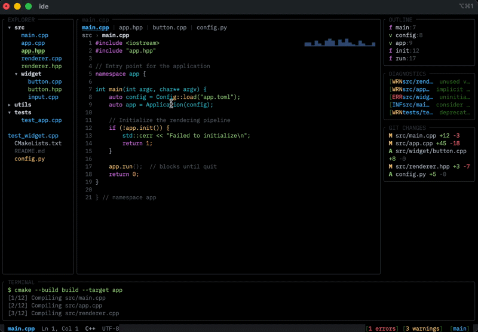

<p align="center">
  
</p>

<h1 align="center">maya</h1>

<p align="center">
  A C++26 terminal UI framework with a compile-time DSL, flexbox layout, SIMD-accelerated rendering, and 50+ widgets.
</p>

<p align="center">
  <a href="#quickstart">Quickstart</a> · <a href="#examples">Examples</a> · <a href="#features">Features</a> · <a href="#building">Building</a>
</p>

---

```cpp
#include <maya/dsl.hpp>
#include <maya/app/run.hpp>

using namespace maya::dsl;

int main() {
    constexpr auto ui = v(
        t<"Hello World"> | Bold | Fg<100, 180, 255>,
        h(
            t<"Status:"> | Dim,
            t<"Online"> | Bold | Fg<80, 220, 120>
        ) | border_<Round> | bcol<50, 55, 70> | pad<1>
    );

    maya::print(ui.build());
}
```

Structure, text, styles, and layout — all resolved at compile time. Pipe operators chain naturally. Type-state machines enforce correctness: you can't set a border color without a border, can't apply layout modifiers to text nodes.

## Examples

21 examples ship with the framework. Here are a few:

<table>
<tr>
<td align="center"><b>Cyberpunk Dashboard</b><br><sub>Oscilloscope · Radar · Hex waterfall · Spirograph</sub></td>
<td align="center"><b>Stock Ticker</b><br><sub>Live charts · Sparklines · Portfolio tracking</sub></td>
</tr>
<tr>
<td></td>
<td></td>
</tr>
<tr>
<td align="center"><b>Doom Fire</b><br><sub>Classic fire effect · Half-block rendering</sub></td>
<td align="center"><b>IDE</b><br><sub>Syntax highlighting · File tree · Tabs</sub></td>
</tr>
<tr>
<td></td>
<td></td>
</tr>
</table>

**Also included:** matrix rain, mandelbrot zoom, fluid simulation, game of life, breakout, snake, particle systems, raymarcher, sorting visualizations, spectrum analyzer, space shooter, music player, system monitor, and more.

## Features

**DSL & Layout**
- Compile-time UI tree construction with `|` pipe operators
- Type-state safety — invalid compositions are compile errors
- Flexbox layout powered by Yoga
- Runtime text via `text()`, compile-time text via `t<"...">`

**Rendering**
- Double-buffered with dirty-region tracking
- SIMD-accelerated diff (AVX2/SSE4.2/NEON) — only changed cells hit the terminal
- 64-bit packed cells for O(1) comparison
- Cache-line aligned buffers, style interning via open-addressing hash map

**Widgets** (50+)
Line chart · Bar chart · Gauge · Sparkline · Heatmap · Progress bar · Table · Tabs · Tree view · Scrollable · Input · Textarea · Select · Slider · Checkbox · Radio · Button · Modal · Popup · Toast · Markdown · Diff view · Calendar · Breadcrumb · Spinner · Badge · Menu · Command palette · Log viewer · Canvas · Gradient · Image · and more

**Runtime**
- Signal/slot reactivity system
- Keyboard, mouse, resize, focus/blur events
- Fullscreen and inline rendering modes
- Alternate screen, raw mode, mouse tracking

## Building

Requires a C++26 compiler. **GCC 15+** is recommended across all platforms.

### macOS (ARM / Intel)

AppleClang does not support C++26. Use Homebrew GCC:

```bash
brew install gcc@15 cmake
cmake -B build -DCMAKE_CXX_COMPILER=g++-15
cmake --build build -j$(sysctl -n hw.ncpu)
```

### Linux (x86_64 / ARM64)

```bash
# Ubuntu/Debian
sudo apt install g++-15 cmake
cmake -B build -DCMAKE_CXX_COMPILER=g++-15
cmake --build build -j$(nproc)

# Arch
sudo pacman -S gcc cmake
cmake -B build
cmake --build build -j$(nproc)

# Fedora
sudo dnf install gcc-c++ cmake
cmake -B build
cmake --build build -j$(nproc)
```

### Windows

**MSYS2 (recommended):**
```bash
pacman -S mingw-w64-ucrt-x86_64-gcc mingw-w64-ucrt-x86_64-cmake
cmake -B build -G "MinGW Makefiles"
cmake --build build -j%NUMBER_OF_PROCESSORS%
```

**Visual Studio 2025+ (MSVC):**
```bash
cmake -B build -G "Visual Studio 17 2025"
cmake --build build --config Release
```

**WSL2:** Follow the Linux instructions above.

### Tests

```bash
cmake -B build -DCMAKE_CXX_COMPILER=g++-15 -DMAYA_BUILD_TESTS=ON
cmake --build build
ctest --test-dir build
```

## License

MIT
