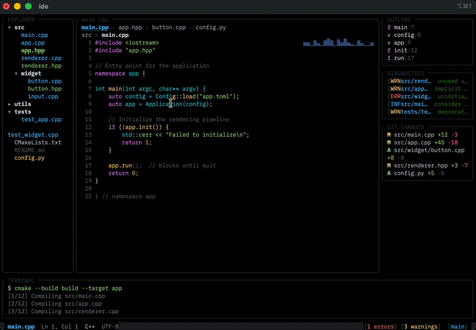

<p align="center">
  
</p>

<h1 align="center">maya</h1>

<p align="center">
  C++26 terminal UI: a type-state compile-time DSL, Yoga flexbox,<br>
  a SIMD cell-diff renderer, and <a href="third_party/jaal">jaal</a> as its runtime.
</p>

<p align="center">
  <a href="#quickstart">Quickstart</a> · <a href="#examples">Examples</a> · <a href="#widgets">Widgets</a> · <a href="docs/">Docs</a> · <a href="#building">Building</a>
</p>

---

- **Compile-time UI trees.** `t<"Hello"> | Bold | border_<Round>` is type-state safe — try to set border color without a border and it's a compile error, not a runtime no-op.
- **SIMD frame diff.** AVX2 / SSE4.2 / NEON. 64-bit packed cells, O(1) compare. Only changed cells write to the terminal.
- **Real flexbox.** Yoga layout — `grow()`, `gap()`, `align()`, `justify()`. No `printf` column-counting.
- **row / col.** The GTK box model with responsiveness built in: `row({cpu, mem, net, disk})` puts cells side by side sharing the width — and wraps, then stacks, by itself as the terminal narrows. `col()` stacks cells that fill the width. Add `sidebar(stats, table, 42)` and a whole three-shape dashboard is two lines — no breakpoints, no spans, zero width arithmetic. See [Responsive Layouts](docs/15-responsive.md).
- **Responsive by measurement.** `fit_row` sheds low-priority items when narrow, `fit_col` sheds low-priority panels when SHORT, `pick` shows the richest alternative that actually fits (SwiftUI's ViewThatFits), `clamp` stops an ultrawide from stretching your UI thin (libadwaita's AdwClamp), `solve_columns` keeps a table's header and rows on one width plan, `fill` sizes a graph to its slot, `place` pins content to any corner — all measured, never hand-estimated.
- **A real data table.** `Table` does selection (▎ cursor + selected-row strip + ↑↓/j/k/PgUp/PgDn), height-aware windowing with a scrollbar (`tbl.build() | grow(1)` — the row count falls out of the layout), host-owned scroll (`window_top` for sticky scroll-margins), sort indicators, flexible columns that truncate with …, column shedding when narrow, per-row/header click rects via the hit registry — and RICH cells: styled spans inside one cell (tree rails, dim argv trails) that clip with the truncation, and `TableCell::dyn` cells painted at the column's solved width (inline meters). htop's working set, one widget — see `examples/proc_table.cpp`.
- **Pretty by default.** `gradient("MAYA", a, b)` sweeps color across text, `rainbow()` does the full spectrum, `gradient_rule()` draws a divider that re-tiles to its pane — one `TextElement` under the hood, so it wraps and measures like plain text. See [Gradients](docs/03-styling.md#gradients).
- **Two render modes.** Fullscreen (alternate screen) or **inline** (lives in your scrollback, doesn't take over the terminal).
- **maya is to jaal what Ink is to React.** [jaal](third_party/jaal) is the runtime: a program's model, one `update` per message, effects (`Cmd`) and subscriptions (`Sub`), timers, threads, streams, shutdown, all checked at compile time. maya draws it. One way to write an app, and `view()` is a pure function of the model.
- **Header-mostly.** `<maya/host/run.hpp>` for an app, `<maya/maya.hpp>` for the view layer alone (static output, tests). Widgets opt-in individually.

## Quickstart

Static UI — fully resolved at compile time:

```cpp
#include <maya/maya.hpp>
using namespace maya::dsl;

int main() {
    constexpr auto ui = v(
        t<"Hello World"> | Bold | Fg<100, 180, 255>,
        h(
            t<"Status:"> | Dim,
            t<"Online"> | Bold | Fg<80, 220, 120>
        ) | border_<Round> | bcol<50, 55, 70> | pad<1>
    );
    maya::print(ui.build());
}
```

An app — the model, one `update` per message, a pure `view`, and the events it listens to:

```cpp
#include <maya/host/run.hpp>
using namespace maya;
using namespace maya::dsl;

struct Counter {
    struct Model { int count = 0; };

    struct Inc {}; struct Dec {}; struct Quit {};
    using Msg = std::variant<Inc, Dec, Quit>;

    using Cmd = jaal::Cmd<Msg>;
    using Sub = jaal::Sub<Msg, on_key>;          // say which event sources you use

    static Cmd update(Model& m, Inc)  { ++m.count; return {}; }
    static Cmd update(Model& m, Dec)  { --m.count; return {}; }
    static Cmd update(Model&,   Quit) { return Cmd::quit(0); }

    static Element view(const Model& m) {
        return v(
            text("Count: " + std::to_string(m.count)) | Bold | Fg<100, 200, 255>,
            t<"[+/-] change  [q] quit"> | Dim
        ) | border_<Round> | bcol<50, 55, 70> | pad<1>;
    }

    static Sub subscribe(const Model&) {
        return keys<Sub>({{'+', Inc{}}, {'-', Dec{}}, {'q', Quit{}}});
    }
};

int main() { return run<Counter>({.title = "counter"}); }
```

That's [`examples/counter.cpp`](examples/counter.cpp). Animation is a
subscription (`Sub::every(16ms, Tick{})`) that you drop when nothing moves,
background work is `Cmd::task`, and pixel art is a view like any other:
`pixels(image)` draws an `Image` with half blocks. Pass
`.mode = Mode::Inline` to render in the scrollback instead of taking the
screen.

## Examples

54 examples ship with the framework, every one a jaal program:

<table>
<tr>
<td align="center"><b>Dashboard</b><br><sub>Oscilloscope · Radar · Hex waterfall · Spirograph</sub></td>
<td align="center"><b>Stock Ticker</b><br><sub>Live charts · Sparklines · Portfolio tracking</sub></td>
</tr>
<tr>
<td></td>
<td></td>
</tr>
<tr>
<td align="center"><b>Doom Fire</b><br><sub>Classic fire effect · Half-block rendering</sub></td>
<td align="center"><b>IDE</b><br><sub>Syntax highlighting · File tree · Tabs</sub></td>
</tr>
<tr>
<td></td>
<td></td>
</tr>
</table>

Plus FPS raycaster, raymarcher, fluid sim, mandelbrot zoom, matrix rain, particle systems, spectrum analyzer, breakout, snake, music player, system monitor, AI agent demos, and more. All under [`examples/`](examples/).

[**moha**](https://github.com/1ay1/moha) — a native terminal client for Claude — is built on maya in production.

## Widgets

**Data:** Line chart · Bar chart · Gauge · Sparkline · Heatmap · Flame chart · Waterfall · Token stream · Context window · Git graph

**Input:** Text input · Textarea · Select · Slider · Checkbox · Radio · Button · Menu · Command palette

**Layout:** Table · Tabs · Tree · Scrollable · Modal · Popup · Toast · Disclosure · Divider · Breadcrumb

**Display:** Markdown · Inline diff · Diff view · Badge · Spinner · Progress bar · Calendar · Canvas · Image · Log viewer

**Agent UI:** Tool call · Bash tool · Read tool · Edit tool · Write tool · Fetch tool · Message · Thinking block · Streaming cursor · Activity bar · Permission prompt · Model badge · Cost tracker · Git status · File changes · System banner · Error block · Turn divider · Conversation view · Plan view · API usage

## Runtime

- The runtime is [jaal](third_party/jaal): `Model` + one `update(Model&, Case)` per message + `view` + `subscribe`. A missing handler, an unused effect, or a subscription the host can't provide is a compile error.
- Effects as data: `Cmd::quit`, `after`, `task`, `send`, batches, plus the terminal's own (`set_title`, `write_clipboard`, `commit_scrollback`, `suspend`, `set_mouse`, ...), listed in the program's `Cmd` type.
- Subscriptions as data: `Sub::every`, `Sub::stream`, and maya's event sources `on_key`, `on_mouse`, `on_paste`, `on_focus`, `on_resize`. Diffed every step, so a timer that stops being subscribed stops.
- Frame flow control: never more than one frame ahead of the terminal, so `q` is instant even over a slow link.
- Signal / slot reactivity (SolidJS-inspired) for widgets that want it.

## Headers

```cpp
#include <maya/host/run.hpp>            // run<P>(), event sources, terminal effects + all of maya.hpp
#include <maya/maya.hpp>           // the view layer: DSL, elements, styles, print()
#include <maya/widget/input.hpp>   // widgets included individually
#include <maya/internal.hpp>       // canvas, diff engine, SIMD, terminal I/O (unstable)
```

| Header | Contains | Stability |
|--------|----------|-----------|
| `app.hpp` | `run`, `Program`, `keys`, event sources, terminal effects (link `maya::app`) | Stable |
| `maya.hpp` | DSL, elements, events, signals, styles, themes, `print` (link `maya::maya`) | Stable |
| `widget/*.hpp` | 90+ widgets | Stable |
| `internal.hpp` | Canvas, diff, renderer, SIMD, terminal I/O, layout | Internal |

## Building

Requires C++26. GCC 15+ recommended on all platforms.

### Linux

```bash
# Arch
sudo pacman -S gcc cmake
cmake -B build && cmake --build build -j$(nproc)

# Ubuntu/Debian
sudo apt install g++-15 cmake
cmake -B build -DCMAKE_CXX_COMPILER=g++-15
cmake --build build -j$(nproc)

# Fedora
sudo dnf install gcc-c++ cmake
cmake -B build && cmake --build build -j$(nproc)
```

### macOS

AppleClang doesn't support C++26. Use Homebrew GCC:

```bash
brew install gcc@15 cmake
cmake -B build -DCMAKE_CXX_COMPILER=g++-15
cmake --build build -j$(sysctl -n hw.ncpu)
```

### Windows

**MSYS2** (recommended):
```bash
pacman -S mingw-w64-ucrt-x86_64-gcc mingw-w64-ucrt-x86_64-cmake
cmake -B build -G "MinGW Makefiles"
cmake --build build -j%NUMBER_OF_PROCESSORS%
```

**Visual Studio 2025+:**
```bash
cmake -B build -G "Visual Studio 17 2025"
cmake --build build --config Release
```

**WSL2:** follow the Linux instructions.

### Tests

```bash
cmake -B build -DMAYA_BUILD_TESTS=ON
cmake --build build
ctest --test-dir build
```

Tests link a non-LTO `-O1` `maya_test` library by default (`MAYA_FAST_TESTS=ON`)
so a header edit recompiles + relinks in seconds instead of waiting on the
production `-O3 + LTO` build. Pass `-DMAYA_FAST_TESTS=OFF` to test against the
full optimized library.

### Build speed

maya is header-heavy, so the defaults are tuned for the edit-build-run loop:

| Option | Default | What it does |
|---|---|---|
| `MAYA_CCACHE` | ON | compile through ccache when installed |
| `MAYA_FAST_EXAMPLES` | ON | examples at `-O1` (they were the biggest slice at `-O3`) |
| `MAYA_EXAMPLES_ALL` | OFF | keep the 55 demos out of the default target |
| `MAYA_FAST_TESTS` | ON | tests link a non-LTO `-O0` library |

So `ninja` builds the library and tests; `ninja maya_fps` builds one demo and
`ninja maya_examples` builds them all. On an 8-core laptop: a cold build of
library + tests is ~95 s, a warm rebuild of everything ~1.5 s, and a real edit
to a core header ~12 s. Turn `MAYA_FAST_EXAMPLES` off to measure or ship a
demo at full optimisation.

## Using maya in your project

```bash
cmake --install build --prefix /usr/local
```

```cmake
find_package(maya 0.1 REQUIRED)
target_link_libraries(my_app PRIVATE maya::app)    # or maya::maya for the view layer alone
```

```cpp
#include <maya/host/run.hpp>
#include <maya/widget/markdown.hpp>
```

## License

MIT.
