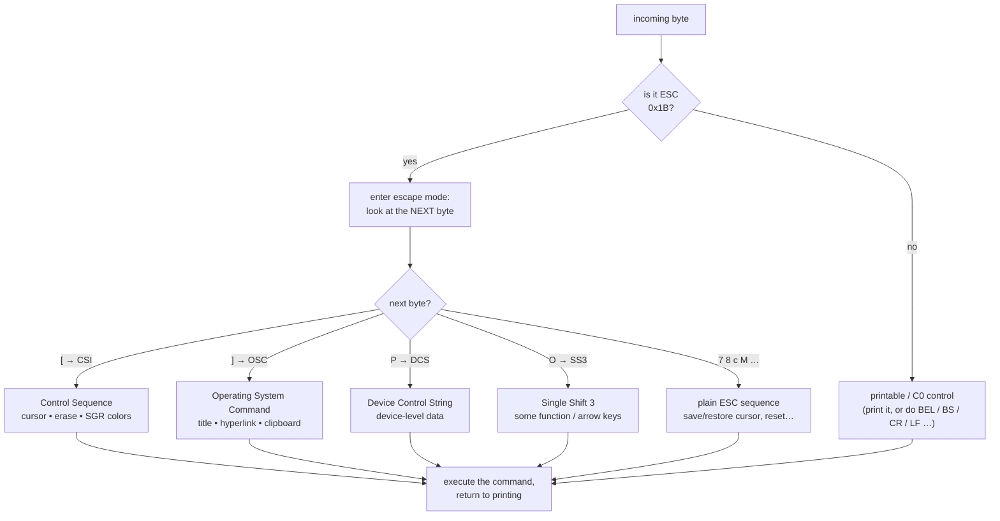
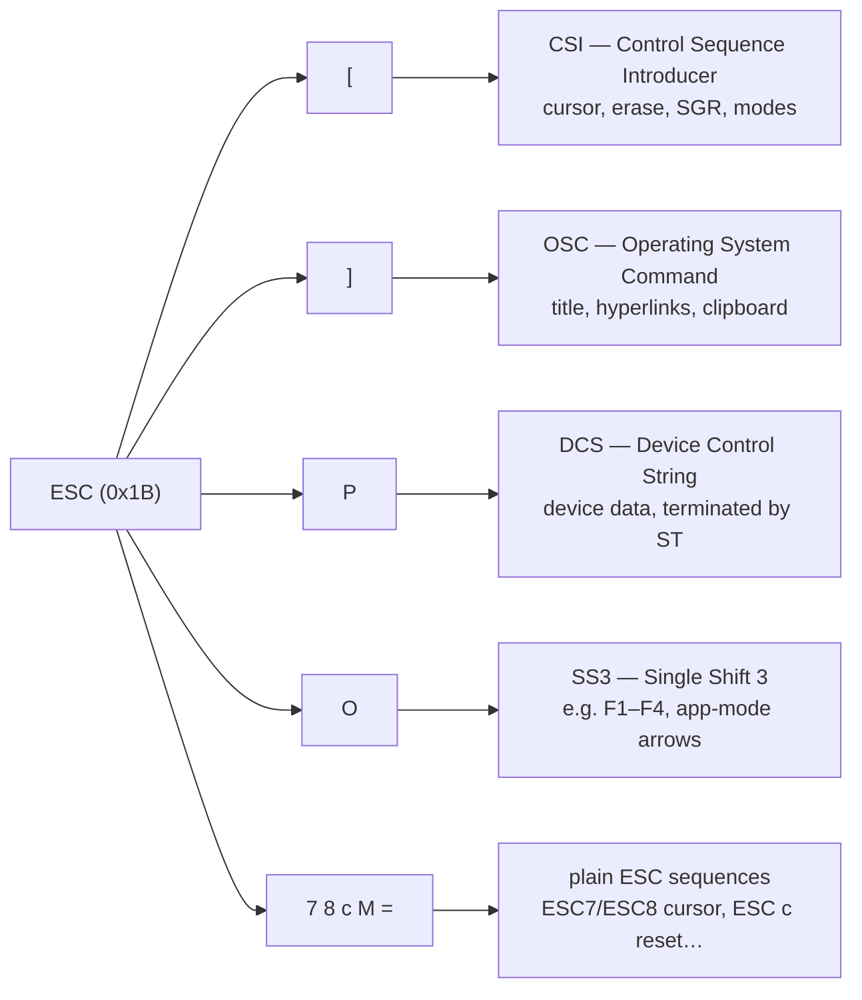
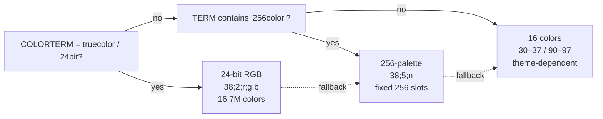
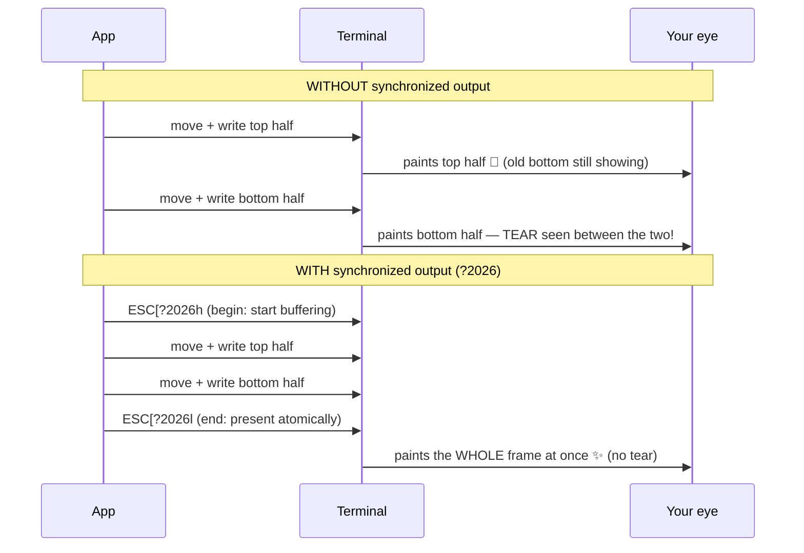

# ANSI Escape Codes

A terminal is, at heart, a device that reads a stream of bytes and paints
glyphs onto a grid. Most of those bytes are *literal* — send the byte `A` and
you get an `A` on screen. But hidden inside that same byte stream is a control
language. A handful of magic byte sequences don't print anything at all;
instead they tell the terminal to **move the cursor**, **change the text
color**, **clear the screen**, **hide the cursor**, or **switch to a whole
different screen buffer**.

That language is **ANSI escape codes**. Every colored prompt, every progress
bar that updates in place, every full-screen text editor, every TUI you've ever
used is built on it. This page is the centerpiece of the Foundations series: if
you understand escape codes, you understand how terminal UIs actually work all
the way down to the wire.

!!! abstract "TL;DR"
    - A terminal prints bytes literally **until** it sees the **ESC** byte
      (`0x1B`, written `\x1b`, `\033`, or `\e` — all the same byte).
    - ESC begins an **escape sequence** the terminal *interprets* instead of
      printing. The biggest family is **CSI** (`ESC[`): cursor moves, erasing,
      and **SGR** colors/styles. Others: **OSC** (`ESC]`, e.g. window titles,
      hyperlinks, clipboard), **DCS**, and **SS3** (`ESC O`, used by some keys).
    - A CSI sequence is `ESC [` + numeric **parameters** (`;`-separated) + an
      optional `?` private-mode marker + a single **final byte** that is the
      verb (`m` = style, `H` = move, `J` = erase…).
    - **SGR** (final byte `m`) handles styles (`1` bold, `4` underline…) and
      three color tiers: **16 colors** (`30–37`/`40–47`, bright `90–97`/`100–107`),
      **256-palette** (`38;5;n`), and **truecolor** (`38;2;r;g;b`). Always
      `ESC[0m` to reset.
    - **Modes** (`ESC[?…h`/`l`) switch behaviors: **alt screen** (`?1049`),
      **synchronized output** (`?2026`, kills tearing), **bracketed paste**
      (`?2004`).
    - Doing this by hand is error-prone: one wrong byte or a forgotten reset can
      **wedge the terminal**. Recover with `reset`, `stty sane`, or
      `printf '\x1bc'`. A framework like [maya](../00-introduction.md) generates
      minimal, correct sequences and always restores a clean state.

!!! note "You already use these every day"
    When `git` prints a red diff line, when `ls` colors directories blue, when
    your shell prompt shows a green checkmark — that's escape codes. Nothing
    exotic is happening. The same `printf` you use for `"Hello\n"` is sending
    them.

---

## The core idea: one byte changes everything

Your terminal reads bytes one at a time. As long as the bytes are ordinary
printable characters, it prints them and advances the cursor. The trick is that
**one specific byte breaks the spell**: the **ESC** byte, value `0x1B`
(decimal 27).

When the terminal sees ESC, it stops printing and starts *listening* — it now
expects the bytes that follow to describe a command. The ESC byte plus the
bytes after it form an **escape sequence**, and the terminal interprets it
rather than displaying it.

Here is the mental model of the terminal as a tiny parser. Every incoming byte
takes one of two roads:



The whole rest of this page is just filling in those boxes.

### The ESC byte and its three notations

You will see the ESC byte written several different ways depending on the
language and shell. **They are all the exact same byte** (`0x1B`):

| Notation | Where you'll see it | Meaning |
|----------|---------------------|---------|
| `\x1b`   | C, C++, Python, most languages | hex escape for `0x1B` |
| `\033`   | C, older code, `printf` | octal escape (27 in octal is 33) |
| `\e`     | bash, `echo -e`, zsh, some C compilers | shell shorthand for ESC |
| `^[`     | what you see if you type it raw, or in `cat -v` | the "caret" rendering of `0x1B` |
| `␛` / `ESC` | docs, this page's prose | a human-readable stand-in |

Throughout this page we write **`\x1b`** in examples because it's the most
portable and unambiguous, but `\033` and `\e` mean the identical byte.

=== "Three notations, one byte"

    ```bash
    # All three print "hi" in bold, then reset. Byte-for-byte identical.
    printf '\x1b[1mhi\x1b[0m\n'
    printf '\033[1mhi\033[0m\n'
    echo  -e '\e[1mhi\e[0m'
    ```

=== "bash string literal"

    ```bash
    # In bash, $'...' interprets backslash escapes (and supports \e).
    msg=$'\e[1mhi\e[0m'
    printf '%s\n' "$msg"
    ```

=== "C string literal"

    ```c
    #include <stdio.h>
    int main(void) {
        /* \x1b is the ESC byte; "\x1b[1m" is ESC '[' '1' 'm' */
        printf("\x1b[1mhi\x1b[0m\n");
        return 0;
    }
    ```

!!! tip "Seeing the raw bytes"
    Want to prove ESC is really there? Pipe output through a byte viewer:
    ```bash
    printf '\x1b[1mhi\x1b[0m\n' | hexdump -C
    ```
    You'll see `1b 5b 31 6d` — that's ESC (`1b`), `[` (`5b`), `1` (`31`),
    `m` (`6d`) — followed by `68 69` (`hi`) and the reset sequence. The ESC
    byte is invisible on screen but absolutely present in the stream. You can
    also pipe to `cat -v`, which renders ESC as `^[`.

### C0 control codes: ESC has siblings

ESC is not the only non-printing byte. The bytes `0x00`–`0x1F` are the **C0
control codes** — a block of 32 low-value bytes that predate ANSI and do small,
fixed jobs. You already use several of them through their backslash escapes
(`\n`, `\t`, `\r`). ESC (`0x1B`) is simply the most powerful member of this
family, because it's the gateway to *everything else*.

| Byte (hex) | Dec | Escape | Name | Effect |
|-----------|-----|--------|------|--------|
| `0x00` | 0 | `\0` | **NUL** | null; ignored / string terminator |
| `0x07` | 7 | `\a` | **BEL** | bell — beep or visual flash |
| `0x08` | 8 | `\b` | **BS** | backspace — cursor left one cell |
| `0x09` | 9 | `\t` | **HT** | horizontal tab — advance to next tab stop |
| `0x0A` | 10 | `\n` | **LF** | line feed — cursor down one line |
| `0x0B` | 11 | `\v` | **VT** | vertical tab — rarely used |
| `0x0C` | 12 | `\f` | **FF** | form feed — often clears / new page |
| `0x0D` | 13 | `\r` | **CR** | carriage return — cursor to column 1 |
| `0x1B` | 27 | `\e` / `\x1b` | **ESC** | escape — begins an escape sequence |

```bash
# BEL rings the terminal bell; BS erases the last char visually; CR rewinds.
printf 'beep\a\n'
printf 'oops\b\b\b\bnice\n'
printf 'overwrite me\rDONE\n'
```

!!! note "`\r` and `\n` are doing real cursor moves"
    `\r` (CR) sends the cursor to **column 1 of the current line** without
    moving down. `\n` (LF) moves **down one line** (and, in a terminal, also to
    column 1). The classic in-place progress bar is nothing but `\r` plus an
    overwrite:
    ```bash
    for i in 1 2 3 4 5; do printf '\rProgress: %d/5' "$i"; sleep 0.3; done; echo
    ```

---

## The families of escape sequences

The byte immediately after ESC selects which *family* of sequence you're in.
You'll spend 95% of your time in CSI, but it pays to recognize the others.



| Family | Intro bytes | Terminator | What it's for |
|--------|-------------|-----------|---------------|
| **CSI** | `ESC [` | a final byte (a letter / punctuation) | cursor, erase, **SGR**, modes — the big one |
| **OSC** | `ESC ]` | **ST** (`ESC \`) or **BEL** (`\a`) | OS-level: window title, hyperlinks, clipboard |
| **DCS** | `ESC P` | **ST** (`ESC \`) | device control strings (e.g. terminal queries, Sixel) |
| **SS3** | `ESC O` | one final byte | a single shifted key: some F-keys / app-mode arrows |
| **Plain** | `ESC` + one byte | — | `ESC 7`/`8` (save/restore cursor), `ESC c` (full reset) |

### A taste of OSC

OSC sequences talk to the *terminal program* rather than the screen grid. They
follow the shape `ESC ] <number> ; <text> ST`, where **ST** (String Terminator)
is `ESC \` (you'll also see `\a`/BEL used as the terminator).

=== "Set the window title (OSC 0)"

    ```bash
    # Set the terminal/tab title to "my build".
    printf '\x1b]0;my build\x1b\\'
    ```

=== "Clickable hyperlink (OSC 8)"

    ```bash
    # OSC 8 ; params ; URI  ST   text   OSC 8 ; ; ST
    printf '\x1b]8;;https://example.com\x1b\\click me\x1b]8;;\x1b\\\n'
    ```

=== "Copy to clipboard (OSC 52)"

    ```bash
    # OSC 52 sets the clipboard; payload is base64. ('c' = clipboard)
    printf '\x1b]52;c;%s\x1b\\' "$(printf 'hello' | base64)"
    ```

!!! note "Why OSC matters for TUIs"
    OSC 8 hyperlinks let a TUI print text that's genuinely *clickable* in modern
    terminals; OSC 52 lets a remote/SSH app put text on your **local** clipboard
    without any extra tooling. Terminals that don't support a given OSC simply
    ignore it.

### A taste of SS3

**SS3** (`ESC O`) shifts *only the next single byte* into an alternate meaning.
You rarely emit it; you mostly *receive* it. In "application cursor key" mode,
arrow keys arrive as `ESC O A`/`B`/`C`/`D` instead of the usual `ESC [ A`…, and
F1–F4 commonly arrive as `ESC O P`/`Q`/`R`/`S`. Decoding these is the subject of
the [Keyboard & Mouse Input](keyboard-and-mouse.md) page.

---

## Anatomy of a CSI sequence

The most common kind of escape sequence is the **CSI** sequence — *Control
Sequence Introducer*. Almost everything you'll write (cursor moves, colors,
clears) is CSI. Its shape is rigid and worth memorizing:

```text
ESC  [   ?    params ; params   intermediate   final-byte
\x1b [        1 ; 31                            m
└─┬┘ │   │    └────┬────┘            │          └┬┘
 ESC CSI  │      parameters          │          final
      intro  optional 'private'   optional      byte (the verb)
            marker '?'            space etc.
```

Breaking it down piece by piece:

1. **`ESC` (`\x1b`)** — the byte that says "a command follows."
2. **`[` (the Control Sequence Introducer)** — the open bracket immediately
   after ESC marks this as a CSI sequence. `ESC` + `[` is so common it has its
   own name: **CSI**.
3. **Private marker (optional)** — a leading `?` marks a *private mode*
   sequence, used by the `h`/`l` toggles (hide cursor, alt screen, etc.). Plain
   commands omit it.
4. **Parameters** — zero or more numbers, separated by semicolons (`;`). What
   they mean depends entirely on the final byte. `1;31` might mean "bold, then
   red"; `10;5` might mean "row 10, column 5." Digits and `;` only — no spaces.
5. **Intermediate bytes (optional)** — bytes in the range `0x20–0x2F` (space,
   `!`, `"`, `#` …) that further qualify rare commands (e.g. the space in the
   DECSCUSR cursor-style sequence `ESC[ <n> SP q`). You'll seldom write these.
6. **The final byte** — a single letter (or a few punctuation chars) in the
   range `0x40–0x7E` that says *what kind of command this is*. `m` = set
   graphics, `H` = move cursor, `A` = cursor up, `J` = erase, `K` = erase line.

The final byte is the verb; the parameters are the arguments.

```bash
# ESC [ 1 ; 31 m  =>  "bold + red foreground"
printf '\x1b[1;31mDANGER\x1b[0m\n'
#       │ │└┬┘│
#       │ │ │ └ final byte 'm' = SGR (set style)
#       │ │ └── params: 1 (bold), 31 (red fg)
#       │ └──── CSI introducer '['
#       └────── ESC
```

!!! warning "Omitted parameters default to a sensible value"
    Most parameters default to `1` (or `0` for SGR) when left out. `\x1b[A`
    moves the cursor up **one** line — same as `\x1b[1A`. `\x1b[;H` moves to
    the home position (row 1, col 1) because both omitted params default. This
    is why you'll see `\x1b[2J` but plain `\x1b[J` is also valid.

??? note "Where do the byte ranges come from? (the ECMA-48 grammar)"
    CSI's grammar is defined by **ECMA-48** (a.k.a. ISO 6429), the standard
    behind "ANSI" escape codes. It partitions the bytes after `ESC[` into
    fixed ranges: **parameter bytes** `0x30–0x3F` (the digits `0–9`, plus `;`,
    `:`, and `<=>?`), **intermediate bytes** `0x20–0x2F`, and a single **final
    byte** `0x40–0x7E`. A parser reads parameter bytes, then intermediate
    bytes, then exactly one final byte — at which point the sequence is
    complete and gets executed. This strict structure is what lets terminals
    parse the stream unambiguously without lookahead.

---

## Cursor control

The cursor is the invisible pen position where the next character will land.
Escape codes let you move it anywhere on the grid — this is how a program
"draws" by jumping around and overwriting cells instead of scrolling.

!!! note "Rows and columns are 1-based"
    The top-left cell is **row 1, column 1** — not `(0,0)`. This trips up every
    programmer at least once.

| Sequence | Name | Effect |
|----------|------|--------|
| `ESC[<r>;<c>H` | **CUP** | move cursor to row `r`, column `c` (1-based) |
| `ESC[<r>;<c>f` | **HVP** | same as CUP; prefer `H` |
| `ESC[<n>A` | **CUU** | cursor up `n` rows |
| `ESC[<n>B` | **CUD** | cursor down `n` rows |
| `ESC[<n>C` | **CUF** | cursor forward (right) `n` columns |
| `ESC[<n>D` | **CUB** | cursor back (left) `n` columns |
| `ESC[<n>E` | **CNL** | cursor to start of line, `n` lines **down** |
| `ESC[<n>F` | **CPL** | cursor to start of line, `n` lines **up** |
| `ESC[<n>G` | **CHA** | cursor to **column** `n` on the current row |
| `ESC[<n>d` | **VPA** | cursor to **row** `n` in the current column |
| `ESC 7` | **DECSC** | save cursor position + attributes (no `[`) |
| `ESC 8` | **DECRC** | restore saved cursor |
| `ESC[s` | (SCO) | save cursor position (CSI variant) |
| `ESC[u` | (SCO) | restore cursor position (CSI variant) |
| `ESC[?25l` | **DECTCEM** | hide cursor |
| `ESC[?25h` | **DECTCEM** | show cursor |

### Absolute positioning

```bash
# Clear the screen, then write "X" at row 5, column 20.
printf '\x1b[2J\x1b[5;20HX\n'
```

`H` (CUP, cursor position) is the workhorse. There's an identical-behaving `f`
(HVP) you may occasionally see; prefer `H`.

### Relative movement

These move the cursor *from where it is now* by `n` cells. `n` defaults to 1.

```bash
# Print "A", move up 1 + right 3, print "B".
printf 'A\x1b[1A\x1b[3CB\n'
```

A handy mnemonic: **A**bove, **B**elow, and C/D are the next letters going
right/left. `CHA` (`ESC[<n>G`) is the one-shot "jump to column `n`" you'll reach
for to re-align a column of text.

### Save and restore the cursor

You can stash the current position and jump back to it later — invaluable when
you want to scribble something elsewhere and return.

=== "Plain ESC form (DECSC/DECRC)"

    ```bash
    # ESC 7 / ESC 8 — note: NO '[' after ESC. Also saves attributes.
    printf 'start\x1b7  ...moved away...\x1b8 BACK\n'
    ```

=== "CSI form (ESC[s / ESC[u)"

    ```bash
    # ESC[s / ESC[u — the CSI-style equivalent (position only).
    printf 'start\x1b[s  ...moved away...\x1b[u BACK\n'
    ```

!!! tip "Two forms, prefer ESC 7 / ESC 8"
    `ESC 7`/`ESC 8` (DECSC/DECRC) also save the current SGR attributes and are
    the more widely/portably supported pair. The `ESC[s`/`ESC[u` CSI variant
    saves position only and can collide with other meanings on some terminals.

### Hide and show the cursor

Full-screen apps almost always hide the blinking cursor so it doesn't flicker
around as the screen redraws. These use the `?` *private mode* form:

```bash
# Hide the cursor for two seconds, then show it again.
printf '\x1b[?25l'; sleep 2; printf '\x1b[?25h'
```

Mnemonic: **`l`** = **l**ow (off), **`h`** = **h**igh (on). This convention is
shared by *every* `?`-mode toggle on this page.

### Cursor shape — DECSCUSR

You can also change the *shape* of the cursor (block, underline, bar) and
whether it blinks. This is the **DECSCUSR** sequence, and it's one of the rare
ones that uses an intermediate byte (the space before `q`):

```text
ESC [ <n> SP q        set cursor style    (SP = a literal space)
```

| `n` | Cursor style |
|-----|--------------|
| `0` or `1` | blinking block (default) |
| `2` | steady block |
| `3` | blinking underline |
| `4` | steady underline |
| `5` | blinking bar (I-beam) |
| `6` | steady bar (I-beam) |

```bash
# Switch to a steady bar cursor, pause, then back to a blinking block.
printf '\x1b[6 q'; sleep 2; printf '\x1b[1 q'
```

---

## Erasing

Moving the cursor doesn't remove old characters — they sit there until
overwritten. To clean up, you erase explicitly. Two verbs cover it: **ED**
(erase in display, final byte `J`) and **EL** (erase in line, final byte `K`).

| Sequence | Name | Effect |
|----------|------|--------|
| `ESC[K` or `ESC[0K` | **EL 0** | erase from cursor to **end of line** |
| `ESC[1K` | **EL 1** | erase from **start of line** to cursor |
| `ESC[2K` | **EL 2** | erase the **entire current line** |
| `ESC[J` or `ESC[0J` | **ED 0** | erase from cursor to **end of screen** |
| `ESC[1J` | **ED 1** | erase from start of screen to cursor |
| `ESC[2J` | **ED 2** | erase the **entire screen** |
| `ESC[3J` | **ED 3** | erase the **scrollback buffer** (history above the screen) |

```bash
# Clear the whole screen and the scrollback, then move home.
printf '\x1b[3J\x1b[2J\x1b[H'
```

!!! tip "Clear-line beats clear-screen for updates"
    Repainting the entire screen with `\x1b[2J` on every frame causes visible
    flicker and wastes bytes. Smart programs erase only what changed —
    `\x1b[K` to wipe the rest of a line they're rewriting. (This is exactly
    the kind of minimal-diff bookkeeping a framework does for you.)

---

## SGR — Select Graphic Rendition (the styling workhorse)

`SGR` is the final byte **`m`**, and it controls *how* text looks: bold,
italic, underline, foreground color, background color. You pass one or more
codes separated by `;`, and they all apply at once.

```text
ESC [ <code> ; <code> ; ... m
```

The styling stays in effect until you change it — so you must **reset** when
you're done, or every line after will inherit your bold-red. Think of SGR as a
small state machine: each code flips one switch in the terminal's "current
attributes," and `0` slams them all back to default.

```mermaid
stateDiagram-v2
    [*] --> Default
    Default --> Bold: ESC[1m
    Bold --> BoldRed: ESC[31m
    BoldRed --> BoldRedUnderline: ESC[4m
    BoldRedUnderline --> Default: ESC[0m (reset)
    BoldRed --> Red: ESC[22m (bold off)
    Red --> Default: ESC[39m (default fg)
    note right of Default
        Every glyph printed
        carries the CURRENT
        attribute set until
        you change it.
    end note
```

### Attributes and their off-switches

Most "on" attributes have a matching "off" code so you can disable just one
thing without resetting everything.

| On | Effect | Off | Off meaning |
|----|--------|-----|-------------|
| `0` | **reset everything** | — | — |
| `1` | bold / increased intensity | `22` | normal intensity (also clears dim) |
| `2` | dim / faint | `22` | normal intensity |
| `3` | italic | `23` | italic off |
| `4` | underline | `24` | underline off |
| `5` | slow blink | `25` | blink off |
| `7` | reverse video (swap fg/bg) | `27` | reverse off |
| `8` | conceal / hidden | `28` | reveal |
| `9` | strikethrough | `29` | strikethrough off |
| `21` | double underline | `24` | underline off |
| — | (set fg color, see below) | `39` | default foreground |
| — | (set bg color, see below) | `49` | default background |

```bash
printf '\x1b[1mbold\x1b[22m  \x1b[3mitalic\x1b[23m  \x1b[4munderline\x1b[24m\n'
printf '\x1b[9mstrikethrough\x1b[29m  \x1b[2mdim\x1b[22m  \x1b[7mreverse\x1b[27m\n'
printf 'all off via reset \x1b[0m done\n'
```

!!! note "`0` is the most important code you'll write"
    `ESC[0m` resets *all* attributes back to the terminal default. Forgetting
    it is the #1 cause of "why is my whole prompt suddenly red?" When in doubt,
    reset. (Targeted off-codes like `22`/`24`/`39` are for when you want to
    keep *some* attributes and clear others.)

### Color tier 1: the 16 basic colors

The original palette. Foreground codes are 30–37, background 40–47. The
**bright** variants are 90–97 (fg) and 100–107 (bg).

| Color | fg | bg | bright fg | bright bg |
|-------|----|----|-----------|-----------|
| black | 30 | 40 | 90 | 100 |
| red | 31 | 41 | 91 | 101 |
| green | 32 | 42 | 92 | 102 |
| yellow | 33 | 43 | 93 | 103 |
| blue | 34 | 44 | 94 | 104 |
| magenta | 35 | 45 | 95 | 105 |
| cyan | 36 | 46 | 96 | 106 |
| white | 37 | 47 | 97 | 107 |

```bash
# Yellow text on a blue background, then bright green.
printf '\x1b[33;44m sunny \x1b[0m \x1b[92mbright green\x1b[0m\n'

# Print all 8 foreground colors as labeled swatches.
for c in 30 31 32 33 34 35 36 37; do printf '\x1b[%dm  %d  \x1b[0m' "$c" "$c"; done; echo
```

These 16 colors are **theme-dependent**: the exact RGB of "red" is whatever the
user's terminal color scheme says it is. That's a feature — your UI matches the
user's chosen palette — but it means you can't rely on a precise shade.

### Color tier 2: the 256-color palette

For more control, terminals expose a fixed palette of 256 colors. The form adds
two extra parameters: `5` (meaning "palette index follows") and the index
`0–255`.

```text
ESC [ 38 ; 5 ; <n> m      foreground = palette color n
ESC [ 48 ; 5 ; <n> m      background = palette color n
```

The 256 slots are organized in three regions:

| Range | Contents |
|-------|----------|
| `0–15` | the 16 basic colors (same as tier 1) |
| `16–231` | a **6×6×6 RGB cube** (216 colors). Index = `16 + 36·r + 6·g + b`, each of `r,g,b` in `0–5` |
| `232–255` | a **24-step grayscale ramp**, dark → light |

```bash
# Print the full 256-color palette as a grid of background swatches.
for n in $(seq 0 255); do
  printf '\x1b[48;5;%dm %3d \x1b[0m' "$n" "$n"
  (( (n+1) % 16 == 0 )) && echo
done
```

### Color tier 3: 24-bit truecolor

Modern terminals support full **24-bit RGB** — 16.7 million colors, any exact
shade you want. The form uses `2` (meaning "RGB follows") and three values
`r;g;b`, each `0–255`.

```text
ESC [ 38 ; 2 ; <r> ; <g> ; <b> m      foreground = exact RGB
ESC [ 48 ; 2 ; <r> ; <g> ; <b> m      background = exact RGB
```

```bash
# Foreground rgb(255,128,0) — a precise orange.
printf '\x1b[38;2;255;128;0mexact orange\x1b[0m\n'

# A smooth truecolor gradient: red -> green across 64 cells.
for i in $(seq 0 63); do
  r=$(( 255 - i*4 )); g=$(( i*4 ))
  printf '\x1b[48;2;%d;%d;0m ' "$r" "$g"
done; printf '\x1b[0m\n'
```

!!! warning "Mind the `5` vs `2` and the semicolons"
    `38;5;n` is **palette** (one index). `38;2;r;g;b` is **truecolor** (three
    channels). Mixing them up — e.g. writing `38;2;200` with a missing channel
    — produces wrong colors or swallows the next character. This finicky,
    easy-to-typo structure is exactly what hand-rolling escape codes gets wrong.

### Capability tiers and graceful downgrade

Not every terminal supports every tier. Truecolor in particular is advertised
through an environment variable:

```bash
echo "$COLORTERM"   # prints 'truecolor' or '24bit' on capable terminals
echo "$TERM"        # e.g. 'xterm-256color' implies 256-color support
```

A robust program (or framework) **downgrades gracefully**: it picks the closest
256-palette color when truecolor is unavailable, and the closest of the 16 when
even 256 isn't there. Your design keeps looking right; only the precision drops.



| Tier | Form | Colors | Detected by |
|------|------|--------|-------------|
| Truecolor | `38;2;r;g;b` | 16.7M | `COLORTERM=truecolor`/`24bit` |
| 256-palette | `38;5;n` | 256 | `TERM` contains `256color` |
| 16-color | `30–37` / `90–97` | 16 | universal baseline |

---

## Modes worth knowing

Beyond cursor and color, terminals expose **modes** — stateful switches toggled
with the `?...h` (set/high) and `?...l` (reset/low) private-mode form. A few
are essential for full-screen apps.

| Mode | Set / reset | What it does |
|------|-------------|--------------|
| Cursor visibility | `ESC[?25h` / `ESC[?25l` | show / hide the cursor |
| **Alt screen** | `ESC[?1049h` / `ESC[?1049l` | switch to / from the scrollback-free scratch buffer |
| **Synchronized output** | `ESC[?2026h` / `ESC[?2026l` | begin / end an atomic frame (kills tearing) |
| **Bracketed paste** | `ESC[?2004h` / `ESC[?2004l` | wrap pasted text in markers |
| **App cursor keys** | `ESC[?1h` / `ESC[?1l` | arrows send `ESC O A…` vs `ESC [ A…` |
| Mouse reporting | `ESC[?1000h` … `ESC[?1006h` | report clicks / motion (see Keyboard & Mouse) |

### Alternate screen buffer — `ESC[?1049h` / `ESC[?1049l`

The terminal has two screens: the **main** buffer (your normal scrollback
history) and an **alternate** buffer (a blank, scrollback-free scratch surface).

When you run `vim`, `less`, `htop`, or `top`, they switch to the alternate
buffer on startup and switch back on exit. That's why, after you quit `vim`,
**your shell history reappears exactly as it was** — the editor never touched
the main buffer; it painted on the alternate one and then discarded it.

```bash
# Enter the alternate screen, draw, wait, then restore the shell.
printf '\x1b[?1049h\x1b[2J\x1b[HI am on the alternate screen!'
sleep 2
printf '\x1b[?1049l'
echo "...and now your old terminal contents are back."
```

!!! tip "This is why your scrollback is safe"
    Full-screen TUIs use the alternate buffer specifically so they can clear
    and repaint freely without destroying the commands and output you had
    before you launched them. Restoring the main buffer on exit is part of
    being a well-behaved terminal citizen.

### Synchronized output (DEC mode 2026) — `ESC[?2026h` / `ESC[?2026l`

Here's a subtle problem. To redraw a frame, a program emits *many* escape
sequences — move here, set color, write text, move there, write more. If the
terminal renders each piece the instant it arrives, the user can briefly see a
**half-drawn frame**: text in the old position next to text in the new one.
This visual glitch is called **tearing**.



**Synchronized output** fixes it. You wrap a frame between a *begin* and *end*
marker; the terminal buffers everything in between and presents it as one atomic
update.

```bash
# Pseudocode shape of a tear-free frame:
#   printf '\x1b[?2026h'        # begin: terminal starts buffering
#   ... all your moves/colors/text for this frame ...
#   printf '\x1b[?2026l'        # end: terminal shows the finished frame
```

Terminals that don't understand mode 2026 simply ignore the markers and render
as before — so it's safe to always emit them. The payoff on terminals that *do*
support it is buttery, flicker-free updates.

### Bracketed paste — `ESC[?2004h` / `ESC[?2004l`

When this mode is on, the terminal wraps **pasted** text between `ESC[200~` and
`ESC[201~`. This lets a program tell the difference between *typing* and
*pasting* — so a pasted newline doesn't accidentally submit a form, and pasted
control characters can be treated as inert text rather than commands.

```bash
# Turn bracketed paste on; now a paste arrives as ESC[200~ <text> ESC[201~.
printf '\x1b[?2004h'
# ... read input, strip the 200~/201~ markers ...
printf '\x1b[?2004l'    # turn it back off when done
```

### Application cursor keys (brief)

With `ESC[?1h` set, the arrow keys send `ESC O A`/`B`/`C`/`D` (SS3 form) instead
of the normal `ESC [ A`…. Some programs request this so they can distinguish
arrow keys more reliably. It mostly affects how you *parse input* — covered on
the [Keyboard & Mouse Input](keyboard-and-mouse.md) page.

---

## Why doing this by hand hurts

Everything above is mechanical and, in isolation, simple. The pain comes from
*composition and bookkeeping*:

- **One wrong byte corrupts the display.** Forget the `m` on an SGR sequence and
  the terminal keeps swallowing your text as parameters. Write `\x1b[38;2;200`
  with a missing channel and the next character vanishes into the sequence.
  A **torn** or truncated escape sequence (e.g. output cut off mid-write, or two
  threads interleaving their `printf`s) can scramble everything that follows.
- **State is invisible and sticky.** You set bold; you must unset bold. You hide
  the cursor; you must show it. You enter the alternate screen; you must leave
  it. Miss any of these — especially on an error path or a crash — and the
  user's terminal is left in a **broken mode** (no cursor, stuck colors, wrong
  buffer). This is *leftover state*, and it survives your program's exit.
- **Mismatched modes.** Enter the alt screen but never leave it, enable
  bracketed paste but never disable it, set application cursor keys and forget
  to reset them — each leaves the shell behaving strangely afterward.
- **Capability juggling.** Truecolor here, 256 there, 16 on that old SSH session
  — you must detect and downgrade or your carefully chosen colors come out
  wrong.
- **Efficiency.** Naively repainting the whole screen every frame floods the
  output and flickers. Doing it well means tracking what actually changed and
  emitting the *minimal* set of sequences — diffing the screen, batching with
  synchronized output, erasing only stale cells.

!!! danger "How to un-wedge a corrupted terminal"
    Sooner or later you'll run a program that crashes mid-draw and leaves your
    shell garbled: no cursor, everything bold-red, keystrokes invisible, or the
    prompt drawing in the wrong place. The terminal isn't broken — it's just
    holding leftover state. Type one of these **blind** (your input may not echo)
    and press ++enter++:

    | Command | What it fixes |
    |---------|---------------|
    | `reset` | full terminal reset — the heavy hammer, fixes almost anything |
    | `stty sane` | restores sane line settings (echo, cooked mode) when keys don't show |
    | `printf '\x1bc'` | emits **RIS** (`ESC c`), a hard reset of the terminal state |
    | `tput cnorm` | just bring back a hidden cursor |
    | `tput sgr0` / `printf '\x1b[0m'` | clear stuck SGR colors/styles |

    If even your typing is invisible, try pressing ++ctrl+c++ first, then type
    `reset` and ++enter++ anyway — it usually works even when you can't see it.

!!! note "Where maya comes in"
    [maya](../00-introduction.md) generates **correct, minimal** escape
    sequences for you. You describe *what* the UI should look like; maya figures
    out the bytes — picking the right color tier for the user's terminal,
    diffing frames so it only repaints what changed, wrapping each frame in
    synchronized output to avoid tearing, and always restoring the terminal to a
    clean state on exit (showing the cursor, leaving the alt screen, resetting
    SGR). Understanding the codes on this page is what lets you reason about
    *why* it does what it does — but you won't be hand-typing `\x1b[38;2;...`
    in application code.

---

## Quick reference

The sequences you'll reach for most often. `ESC` = `\x1b` = `\033` = `\e`.

| Sequence | Meaning |
|----------|---------|
| **Cursor** | |
| `ESC[<r>;<c>H` | move cursor to row `r`, col `c` (1-based) — CUP |
| `ESC[<n>A` / `B` / `C` / `D` | move cursor up / down / right / left `n` |
| `ESC[<n>G` | move to column `n` (CHA) |
| `ESC7` / `ESC8` | save / restore cursor position + attributes |
| `ESC[s` / `ESC[u` | save / restore cursor position (CSI variant) |
| `ESC[?25l` / `ESC[?25h` | hide / show cursor |
| `ESC[<n> q` | cursor style (DECSCUSR; note the space) |
| `\r` | carriage return (cursor to column 1) |
| `\n` | line feed (cursor down one line) |
| **Erasing** | |
| `ESC[K` / `ESC[1K` / `ESC[2K` | erase to EOL / to BOL / whole line |
| `ESC[J` / `ESC[1J` / `ESC[2J` | erase to end / to start / whole screen |
| `ESC[3J` | erase scrollback |
| **Styling (SGR)** | |
| `ESC[0m` | **reset all styles** |
| `ESC[1m` / `2m` / `3m` / `4m` / `7m` / `9m` | bold / dim / italic / underline / reverse / strike |
| `ESC[22m` / `23m` / `24m` / `27m` / `29m` | turn off bold-dim / italic / underline / reverse / strike |
| `ESC[30–37m` / `40–47m` | basic fg / bg color |
| `ESC[90–97m` / `100–107m` | bright fg / bg color |
| `ESC[39m` / `49m` | default fg / bg color |
| `ESC[38;5;<n>m` / `48;5;<n>m` | 256-palette fg / bg |
| `ESC[38;2;<r>;<g>;<b>m` / `48;2;...m` | truecolor fg / bg |
| **Modes & families** | |
| `ESC[?1049h` / `?1049l` | enter / leave alternate screen |
| `ESC[?2026h` / `?2026l` | begin / end synchronized output |
| `ESC[?2004h` / `?2004l` | enable / disable bracketed paste |
| `ESC]0;<title>ESC\` | set window title (OSC 0) |
| `ESC]8;;<uri>ESC\<text>ESC]8;;ESC\` | hyperlink (OSC 8) |
| `ESC c` | full terminal reset (RIS) |

---

## What's next

You now know how to *write* to the terminal — how a program paints styled,
positioned output, and how to keep that output atomic, downgradeable, and clean.
The other half of a TUI is reading back what the user does: keystrokes, arrow
keys, function keys, and mouse clicks all arrive as their own (often
escape-code-shaped) byte sequences — the very `ESC [` and `ESC O` forms you met
above, now flowing the *other* direction. Decoding them is the subject of the
next Foundations page:

→ **[Keyboard & Mouse Input](keyboard-and-mouse.md)**
