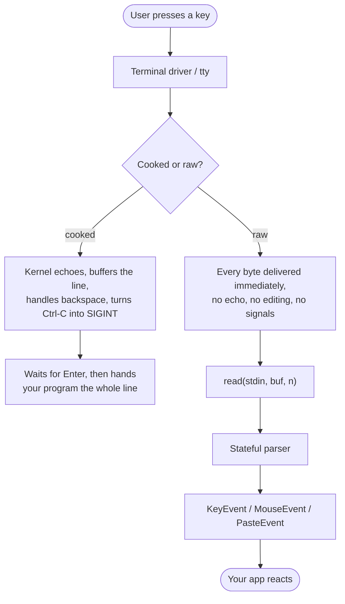
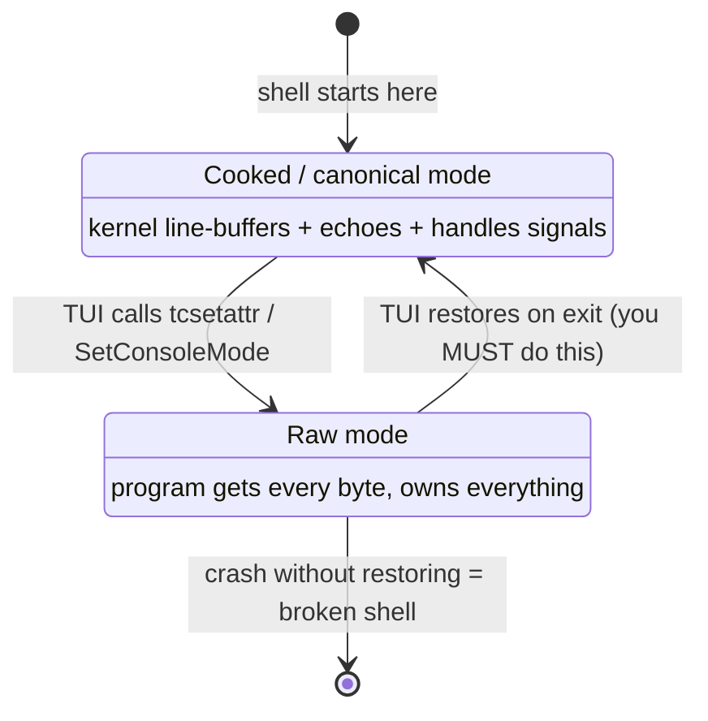
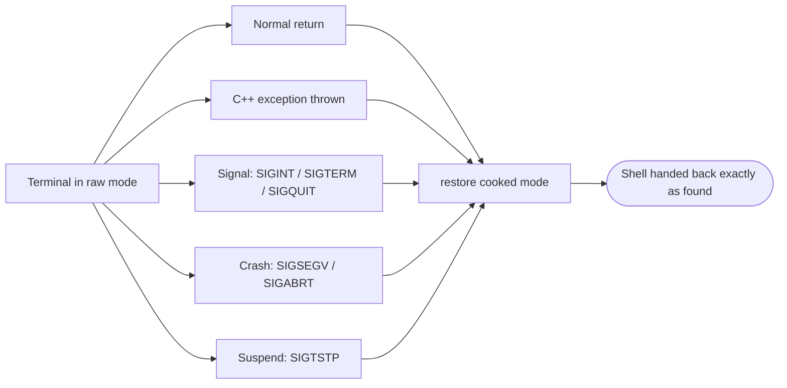
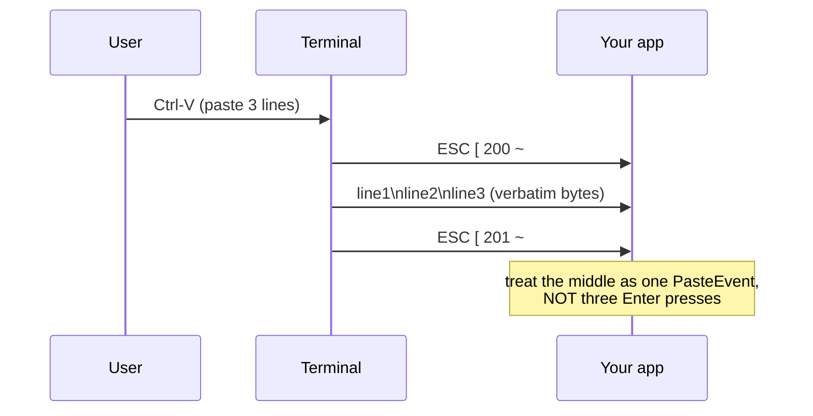

# Keyboard & Mouse Input

!!! abstract "TL;DR"
    - A terminal hands your program **bytes**, not key events. There is no `getKeyPress()`.
    - It runs in one of two modes: **cooked** (the kernel buffers a whole line, echoes it, and turns ++ctrl+c++ into a signal) or **raw** (every byte arrives instantly, nothing is echoed, nothing is interpreted). Every full-screen TUI runs in raw mode.
    - Entering raw mode is a **contract**: if you don't restore the terminal on *every* exit path — normal return, exception, ++ctrl+c++, even a segfault — you leave the user's shell broken. `stty sane` or `reset` is the rescue.
    - Printable keys are their UTF-8 bytes. Control keys are `0x00`–`0x1F`. Special keys (arrows, F-keys, Home/End) are **escape sequences** starting with ++esc++ (`0x1B`).
    - A lone ++esc++ is ambiguous: it might be the Escape key, or the first byte of an arrow key. Sequences can split across `read()` calls. So a real input layer is a **stateful parser**, not a lookup table.
    - Mouse input, bracketed paste, and the modern Kitty/CSI-u protocol are all *more* escape sequences you opt into.
    - maya turns this entire mess into clean, typed `KeyEvent` / `MouseEvent` / `PasteEvent` objects and restores the terminal for you no matter how you exit.

You press a key. A letter appears. Surely there's a function somewhere called
`getKeyPress()` and that's the end of it?

Not even close. Reading input in a terminal is one of the most surprisingly
deep corners of TUI programming. The terminal was designed in the 1970s to talk
to physical teletype machines over serial lines, and almost every quirk you'll
fight today is an echo of that history. By the end of this page you'll know
exactly what happens between a keypress and your program — and why a real
framework spends a lot of code hiding it from you.

This is the fourth page in the **Foundations** series. We've covered what a
terminal *is* and how text gets *out* of your program. Now we go the other
direction: how bytes get *in*.

Here's the whole journey on one diagram. Don't worry if it's opaque now — every
box is explained below.



---

## The two modes of a terminal

Every terminal — more precisely, the *terminal driver* (the **tty**, "teletype")
inside your operating system — operates in one of two fundamental modes.
Understanding the difference is the single most important idea on this page.



### Cooked mode (canonical mode)

This is the default. It's what you get when you write a normal command-line
program that calls `read()` or `scanf` or `std::getline`. It's called "cooked"
because the kernel does a lot of helpful preparation before your program ever
sees the data.

In cooked mode, **the kernel line-buffers input**. When the user types, the
following all happen *inside the operating system*, before your program is
involved at all:

- Characters are echoed to the screen automatically (you see what you type).
- ++backspace++ erases the previous character from the buffer. Your program
  never learns the character was typed and then deleted.
- ++ctrl+c++ raises `SIGINT` and (by default) kills your program.
- ++ctrl+z++ suspends it. ++ctrl+d++ signals end-of-input.
- ++ctrl+u++ / ++ctrl+w++ do line-kill and word-erase.
- Nothing is handed to your program until the user presses ++enter++. At that
  point the *entire finished line* arrives in one `read()`.

This is wonderful for a shell command. You ask a question, the user types an
answer, fixes their typos, and presses ++enter++; you get one clean string. The
kernel did the editing for you.

It's a disaster for a TUI.

A TUI needs to react the *instant* a key is pressed — arrow keys should move a
cursor immediately, ++j++ / ++k++ should scroll without an ++enter++, and you
certainly don't want the kernel echoing keystrokes wherever the text cursor
happens to be, scribbling over your carefully drawn interface. You also want
++ctrl+c++ to be a key event you can choose to handle, not an instant death
sentence.

### Raw mode

Raw mode turns off all that helpfulness. In raw mode:

- **No echo.** Keystrokes are not auto-printed. *You* decide what appears on
  screen.
- **No line buffering.** Every byte is delivered to your program the moment it
  arrives — no waiting for ++enter++.
- **No line editing.** ++backspace++ is just a byte (`0x7F`); it's your job to
  decide what it means.
- **No signal generation** (optional). ++ctrl+c++ arrives as the byte `0x03`
  instead of killing you — unless you choose to leave signals on.

This is the mode every full-screen TUI runs in. The terminal becomes a dumb pipe
that hands you raw bytes, and your program takes full responsibility for
interpreting them.

### Cooked vs raw, side by side

| Behavior | Cooked (canonical) | Raw |
|----------|--------------------|-----|
| When you get data | after ++enter++, a whole line | every byte, immediately |
| Echo to screen | automatic, by the kernel | none — you draw it yourself |
| ++backspace++ / line editing | kernel edits the buffer | raw byte, you handle it |
| ++ctrl+c++ | `SIGINT` (kills you) | byte `0x03` (a key event) |
| ++ctrl+z++ | suspends (`SIGTSTP`) | byte `0x1A` |
| ++ctrl+s++ / ++ctrl+q++ | flow-control freeze/resume | bytes `0x13` / `0x11` |
| ++ctrl+d++ | end-of-file | byte `0x04` |
| CR ↔ LF translation | yes (++enter++ → `\n`) | none — you see `0x0D` |
| Good for | shell commands, prompts | full-screen TUIs |

!!! note "Cooked vs raw, in one sentence each"
    Cooked mode = "the kernel helps you read a *line*."<br/>
    Raw mode = "give me every *byte*, right now, and get out of my way."

### The termios flags, one by one

On POSIX systems (Linux, macOS, BSD), terminal behavior is controlled through a
struct called `termios`, manipulated with `tcgetattr()` (read current settings)
and `tcsetattr()` (write them back). Each behavior above is one bit in one of
four flag fields. Here is exactly what turning each one **off** does — which is
what "going raw" means:

| Flag | Field | Normally on, does… | Turn it OFF and… |
|------|-------|--------------------|--------------------|
| `ICANON` | `c_lflag` (local) | canonical/line buffering | bytes arrive immediately, no ++enter++ wait, no line editing |
| `ECHO` | `c_lflag` | echoes typed chars | nothing is auto-printed; you control the screen |
| `ISIG` | `c_lflag` | ++ctrl+c++/++ctrl+z++ → signals | those become ordinary bytes `0x03` / `0x1A` |
| `IEXTEN` | `c_lflag` | extended input (e.g. ++ctrl+v++ literal-next) | ++ctrl+v++, ++ctrl+o++ stop being special |
| `IXON` | `c_iflag` (input) | ++ctrl+s++/++ctrl+q++ flow control | ++ctrl+s++ no longer freezes your output |
| `ICRNL` | `c_iflag` | translates input CR → LF | ++enter++ arrives as raw `0x0D` (CR), not `\n` |
| `OPOST` | `c_oflag` (output) | post-processes output (LF → CRLF) | you must write `\r\n` yourself; output is verbatim |

Two more fields control *how `read()` blocks* once `ICANON` is off — these
replace line-buffering with byte-level timing:

| Field | Meaning |
|-------|---------|
| `VMIN` | minimum bytes `read()` must collect before it returns |
| `VTIME` | timeout in tenths of a second |

The classic combinations:

- `VMIN=1, VTIME=0` — block until at least one byte arrives. The common choice.
- `VMIN=0, VTIME=0` — return immediately, even with nothing (non-blocking poll).
- `VMIN=0, VTIME=1` — wait up to 100 ms for a byte, then return. Handy for the
  Escape-timeout trick you'll meet later.

### The "enter raw mode" recipe

Conceptually, going raw is always the same four steps: **save, copy, flip bits,
apply** — and crucially, *save the originals so you can restore them.*

=== "Linux/macOS (termios)"

    ```c
    #include <termios.h>
    #include <unistd.h>

    struct termios original;          // save the cooked settings!

    void enable_raw_mode(void) {
        tcgetattr(STDIN_FILENO, &original);        // 1. read current state
        struct termios raw = original;             // 2. copy it
        raw.c_lflag &= ~(ICANON | ECHO | ISIG | IEXTEN);  // 3. flip local bits off
        raw.c_iflag &= ~(IXON | ICRNL);            //    flip input bits off
        raw.c_oflag &= ~(OPOST);                   //    raw output too
        raw.c_cc[VMIN]  = 1;                       //    block for >= 1 byte
        raw.c_cc[VTIME] = 0;
        tcsetattr(STDIN_FILENO, TCSAFLUSH, &raw);  // 4. apply
    }

    void disable_raw_mode(void) {
        tcsetattr(STDIN_FILENO, TCSAFLUSH, &original);  // restore!
    }
    ```

    `TCSAFLUSH` means "apply after draining pending output and discarding
    pending input," which avoids stray buffered bytes leaking between modes.

=== "Windows (console mode)"

    ```c
    #include <windows.h>

    HANDLE hIn = GetStdHandle(STD_INPUT_HANDLE);
    DWORD original;                    // save the cooked settings!

    void enable_raw_mode(void) {
        GetConsoleMode(hIn, &original);            // 1. read current state
        DWORD raw = original;                      // 2. copy it
        raw &= ~(ENABLE_LINE_INPUT       // 3. clear flags: like ICANON
              |  ENABLE_ECHO_INPUT        //    like ECHO
              |  ENABLE_PROCESSED_INPUT); //    like ISIG (Ctrl-C handling)
        raw |= ENABLE_VIRTUAL_TERMINAL_INPUT;  // get xterm-style escape sequences
        SetConsoleMode(hIn, raw);                  // 4. apply
    }

    void disable_raw_mode(void) {
        SetConsoleMode(hIn, original);             // restore!
    }
    ```

    The flags map almost one-to-one onto termios: `ENABLE_LINE_INPUT` ≈
    `ICANON`, `ENABLE_ECHO_INPUT` ≈ `ECHO`, `ENABLE_PROCESSED_INPUT` ≈ `ISIG`.
    `ENABLE_VIRTUAL_TERMINAL_INPUT` asks the modern Windows console to deliver
    the same VT/ANSI escape sequences that POSIX terminals send, so one parser
    can serve both worlds. The idea is identical; only the API differs. A
    cross-platform framework wraps both.

---

## The single most important rule: restore the terminal

Notice the `original` variable in both recipes above. That's not optional
bookkeeping — it's the whole ballgame.

!!! danger "If you enable raw mode, you MUST restore cooked mode on exit"
    The terminal's mode is **global state owned by the terminal, not by your
    process.** When your program exits, the OS does *not* automatically reset it.
    If you crash, get killed, or simply forget to restore — the user's shell is
    left in raw mode.

    They'll type and see **nothing** (echo is off). ++ctrl+c++ won't work
    (signals are off). ++enter++ won't start a new line (CR translation is off).
    The prompt looks frozen and broken. It is one of the worst first impressions
    a TUI can make, and the user almost never blames the right thing — they blame
    their machine.

### "My shell is broken after the app crashed"

This is the symptom, and you will cause it at least once while learning. The
session looks dead: you type, nothing echoes; you hit ++enter++, the cursor
doesn't move to a new line; ++ctrl+c++ does nothing. The terminal isn't broken —
it's still in raw mode because the crashed app never restored it.

The rescue, typed **blind** (you won't see the characters as you type them):

| Command | What it does |
|---------|--------------|
| `stty sane` | resets the tty's line discipline to sane defaults |
| `reset` | fuller reset — also clears the screen and re-inits the terminal |
| `tput reset` | similar; uses the terminfo entry |

After ++ctrl+c++ doesn't work, try pressing ++ctrl+j++ (a literal line feed)
before and after the command, since ++enter++'s CR may not be translated:
`Ctrl-J` `s` `t` `t` `y` `space` `s` `a` `n` `e` `Ctrl-J`. Worst case, close the
window and open a fresh one.

### Restore on *every* exit path

A naive program restores the terminal at the end of `main()`. But what if you
never *reach* the end of `main()`? A serious TUI library installs restoration on
every plausible exit path:



- **Normal exit** — via `atexit()` and/or RAII destructors. RAII is the idiomatic
  C++ answer: a guard object enters raw mode in its constructor and restores in
  its destructor, so any return path — including stack unwinding from a thrown
  exception — restores the terminal automatically.
- **Signals** — a handler for `SIGINT`, `SIGTERM`, `SIGQUIT` that restores the
  terminal *before* re-raising the signal to die properly.
- **Crashes** — even a handler for `SIGSEGV` / `SIGABRT` that restores the tty as
  its dying act, so a segfault in your app doesn't also wreck the user's shell.
- **Suspension** — restore on `SIGTSTP` (++ctrl+z++) and re-enter raw mode on
  `SIGCONT` when the job is resumed with `fg`.

!!! tip "Why a framework earns its keep here"
    Getting all of this right is fiddly and easy to forget. This is one of the
    first things maya handles for you: enter `run()` and the terminal is put into
    raw mode; leave it — *however* you leave it, including via a crash — and the
    terminal is handed back exactly as it was found.

---

## How keys actually arrive: it's just bytes

Once you're in raw mode, `read(STDIN_FILENO, buf, n)` hands you bytes. That's the
entire interface. There is no rich `KeyEvent` waiting for you; there is a stream
of `uint8_t`. Your job is to decode meaning from it. Keys fall into three
categories.

### 1. Printable keys → their bytes

The easy case. Press ++a++, you get one byte: `0x61`. Press ++"A"++ (with
++shift++ held), you get `0x41`. The shift key itself is invisible — the terminal
already folded it into the resulting character.

Non-ASCII printable characters arrive as their **UTF-8 encoding**, which means a
single keypress can be multiple bytes:

| Key | Bytes (hex) | Notes |
|-----|-------------|-------|
| `a` | `61` | one byte |
| `A` | `41` | shift already applied |
| `é` | `C3 A9` | 2-byte UTF-8 |
| `€` | `E2 82 AC` | 3-byte UTF-8 |
| `😀` | `F0 9F 98 80` | 4-byte UTF-8 |

So even "just a printable character" requires UTF-8 decoding to reassemble
multi-byte runes from the byte stream — and those bytes can be split across
separate `read()` calls.

### 2. Control keys → control bytes

The bottom 32 byte values (`0x00`–`0x1F`) are *control codes*, the **C0** range.
Historically, holding ++ctrl++ and pressing a letter clears the top bits of its
ASCII code, which is why the mapping is so regular.

!!! note "The ++ctrl+key++ math"
    `Ctrl-<letter>` = (letter's ASCII code) `AND 0x1F` = letter's position in the
    alphabet. ++ctrl+a++ → `0x01`, ++ctrl+b++ → `0x02`, … ++ctrl+z++ → `0x1A`.
    Lowercase `a` is `0x61`; `0x61 & 0x1F = 0x01`. That's the whole trick.

| Key | Byte | Name | Notes |
|-----|------|------|-------|
| ++ctrl+a++ | `0x01` | SOH | start of heading |
| ++ctrl+c++ | `0x03` | ETX | would be `SIGINT` in cooked mode |
| ++ctrl+d++ | `0x04` | EOT | would be EOF in cooked mode |
| ++ctrl+h++ | `0x08` | BS | backspace (the *original* one) |
| ++tab++ | `0x09` | HT | identical to ++ctrl+i++ |
| ++ctrl+j++ | `0x0A` | LF | line feed, `\n` |
| ++ctrl+m++ | `0x0D` | CR | carriage return, `\r` — identical to ++enter++ |
| ++ctrl+q++ | `0x11` | DC1 | XON (flow control resume) |
| ++ctrl+s++ | `0x13` | DC3 | XOFF (flow control freeze) |
| ++ctrl+z++ | `0x1A` | SUB | would be `SIGTSTP` in cooked mode |
| ++esc++ | `0x1B` | ESC | remember this one! |
| ++backspace++ | `0x7F` | DEL | what most keyboards actually send |

#### Enter, Tab, Backspace, Delete: the subtleties

These four trip up everyone, because the byte rarely matches the key's name.

- **++enter++ sends CR (`0x0D`), not LF.** Pressing ++enter++ produces carriage
  return `0x0D`, the same byte as ++ctrl+m++. In cooked mode the kernel
  translates it to `\n` (`0x0A`) for you via `ICRNL`; in raw mode you see the raw
  `0x0D` and must decide what it means. LF (`0x0A`, `\n`) is what ++ctrl+j++
  sends. **CR is "go to column 0," LF is "move down a line"** — a teletype needed
  both, which is why files on some systems still end lines with `\r\n`.
- **++tab++ is `0x09`, the same byte as ++ctrl+i++.** In a legacy terminal you
  literally cannot tell ++tab++ from ++ctrl+i++ apart.
- **Backspace is usually `0x7F` (DEL), not `0x08` (BS).** Most modern keyboards'
  ++backspace++ key sends DEL `0x7F`. The byte `0x08` (BS) is what ++ctrl+h++
  sends, and what the *forward-delete* / very old terminals sometimes use. If
  your backspace handling does nothing, you're probably matching the wrong byte.
- **The ++delete++ (forward-delete) key is *not* a control byte at all** — it's
  an escape sequence (`ESC [ 3 ~`, see below). So "Delete" the editing key and
  "DEL" the byte `0x7F` are unrelated despite sharing a name. Welcome to
  terminals.

!!! warning "Two collisions to burn into memory"
    ++tab++ ≡ ++ctrl+i++ (`0x09`), and ++enter++ ≡ ++ctrl+m++ (`0x0D`). At the
    byte level they are *indistinguishable* in the legacy world. The Kitty
    protocol (below) is what finally lets you tell them apart.

### 3. Special keys → escape sequences

Here's the twist that makes terminal input genuinely tricky. Keys that aren't
characters — arrows, function keys, ++home++, ++end++, ++page-up++ — don't have a
single byte. They send a **multi-byte escape sequence**, almost always beginning
with the ++esc++ byte (`0x1B`), followed by an *introducer*:

- **CSI** — Control Sequence Introducer — `ESC [` (`0x1B 0x5B`). Arrows,
  Home/End, navigation keys, function keys F5+.
- **SS3** — Single Shift Three — `ESC O` (`0x1B 0x4F`). Function keys F1–F4 in
  the classic xterm "application" mode.

| Key | Bytes (hex) | As text | Introducer |
|-----|-------------|---------|------------|
| ++up++ | `1B 5B 41` | `ESC [ A` | CSI |
| ++down++ | `1B 5B 42` | `ESC [ B` | CSI |
| ++right++ | `1B 5B 43` | `ESC [ C` | CSI |
| ++left++ | `1B 5B 44` | `ESC [ D` | CSI |
| ++home++ | `1B 5B 48` | `ESC [ H` | CSI |
| ++end++ | `1B 5B 46` | `ESC [ F` | CSI |
| ++page-up++ | `1B 5B 35 7E` | `ESC [ 5 ~` | CSI |
| ++page-down++ | `1B 5B 36 7E` | `ESC [ 6 ~` | CSI |
| ++insert++ | `1B 5B 32 7E` | `ESC [ 2 ~` | CSI |
| ++delete++ | `1B 5B 33 7E` | `ESC [ 3 ~` | CSI |
| ++f1++ | `1B 4F 50` | `ESC O P` | SS3 |
| ++f2++ | `1B 4F 51` | `ESC O Q` | SS3 |
| ++f3++ | `1B 4F 52` | `ESC O R` | SS3 |
| ++f4++ | `1B 4F 53` | `ESC O S` | SS3 |
| ++f5++ | `1B 5B 31 35 7E` | `ESC [ 1 5 ~` | CSI |
| ++f6++ | `1B 5B 31 37 7E` | `ESC [ 1 7 ~` | CSI |
| ++f7++ | `1B 5B 31 38 7E` | `ESC [ 1 8 ~` | CSI |
| ++f8++ | `1B 5B 31 39 7E` | `ESC [ 1 9 ~` | CSI |
| ++f9++ | `1B 5B 32 30 7E` | `ESC [ 2 0 ~` | CSI |
| ++f10++ | `1B 5B 32 31 7E` | `ESC [ 2 1 ~` | CSI |
| ++f11++ | `1B 5B 32 33 7E` | `ESC [ 2 3 ~` | CSI |
| ++f12++ | `1B 5B 32 34 7E` | `ESC [ 2 4 ~` | CSI |

Notice the patternlessness: ++f5++ jumps from `15~` (there is no `14~`), and
F1–F4 use a completely different introducer from F5+. And modifiers complicate
it further — holding ++shift++ with ++up++ typically yields `ESC [ 1 ; 2 A`,
where the `;2` is a modifier parameter (2 = shift, 3 = alt, 5 = ctrl, and sums
for combinations).

!!! warning "The ++esc++ byte does double duty"
    This is the deep symmetry that confuses everyone. In the previous page we saw
    that **output** styling uses escape sequences: `ESC [ 31 m` to turn text red.
    Now we see that **input** special keys *also* arrive as escape sequences
    starting with `ESC [`. The very same byte (`0x1B`) you write *out* to color
    your UI is the byte that comes *in* to signal an arrow key.

    The terminal is a half-duplex stream of bytes where ++esc++ is the universal
    "something structured follows" marker — in both directions.

There is no single tidy rule; the sequences are a historical patchwork, and they
vary between terminal types (`xterm`, `rxvt`, the `linux` console, etc.). This is
exactly the kind of mess a framework normalizes away.

---

## The Escape ambiguity problem

Now we hit the single nastiest gotcha in terminal input. Look again at the table
above: every special key starts with the ++esc++ byte (`0x1B`). But ++esc++ is
*also* a key the user can press all by itself — to cancel a dialog, leave a mode,
close a menu.

So when your `read()` returns a lone `0x1B`, you face an impossible question:

> Did the user press the **++esc++ key**, or is this the **first byte of an arrow
> key** whose remaining bytes (`[ A`) haven't arrived yet?

You cannot tell from the byte alone. The information simply isn't there yet.

### The ++alt+key++ wrinkle

It gets worse. By convention, holding ++alt++ (the "Meta" key) and pressing a key
sends ++esc++ *followed by that key's normal byte*. So ++alt+a++ arrives as
`ESC` `a` = `0x1B 0x61`. That means a lone `ESC` could be:

1. the ++esc++ key by itself, or
2. the start of a CSI/SS3 special-key sequence (`ESC [ …`), or
3. the ++alt++ modifier on whatever byte comes next (`ESC` `a`).

| Bytes received | Most likely meaning |
|----------------|---------------------|
| `1B` then nothing | ++esc++ key alone |
| `1B 5B 41` | ++up++ arrow (CSI) |
| `1B 4F 50` | ++f1++ (SS3) |
| `1B 61` | ++alt+a++ |
| `1B 1B` | ++esc++ then ++esc++ (or Alt-Esc, ambiguous) |

### The timeout heuristic

The classic disambiguation strategy: after seeing `ESC`, **wait a short interval**
(commonly ~25–50 ms, the `VTIME` trick from earlier). A human cannot type `ESC`
then `[` then `A` within single-digit milliseconds, but a terminal *emits* the
bytes of an escape sequence back-to-back. So:

- More bytes arrive almost instantly → it's a sequence; keep reading and match.
- Nothing arrives within the window → it was a standalone ++esc++ press.

This is why some TUIs feel like ++esc++ has a tiny lag, and why pressing ++esc++
quickly twice can behave oddly.

### Split reads, and why a parser must buffer

Layered on top is a second headache: **sequences can be split across `read()`
calls.** The kernel might hand you `ESC [` in one read and `A` in the next,
simply because of how the bytes were buffered or how the terminal flushed them.
So your parser cannot be a `switch` over a fixed-size buffer. It must be a
**stateful machine** that remembers "I'm currently in the middle of a CSI
sequence" across reads, accumulating bytes until it has enough to decide.

Here is the heart of such a parser as a state diagram:

```mermaid
stateDiagram-v2
    [*] --> Ground
    Ground --> Ground: printable byte → emit KeyEvent(char)
    Ground --> Ground: C0 control byte → emit KeyEvent(ctrl)
    Ground --> SawEsc: byte == 0x1B (ESC)

    SawEsc --> Ground: timeout, no more bytes → emit KeyEvent(Esc)
    SawEsc --> CSI: next byte == '[' (0x5B)
    SawEsc --> SS3: next byte == 'O' (0x4F)
    SawEsc --> Ground: next byte is printable → emit KeyEvent(Alt+char)

    CSI --> CSI: collect params (digits, ';')
    CSI --> Ground: final byte (A-Z, ~) → emit Key/MouseEvent
    SS3 --> Ground: final byte (P-S, ...) → emit KeyEvent(F1-F4)

    note right of SawEsc
        The ambiguity lives here:
        wait briefly (VTIME) to decide
        Esc-alone vs sequence vs Alt-key
    end note
```



!!! tip "This is the heart of why a parser exists"
    A lone byte is ambiguous. A sequence can arrive in pieces. ++esc++ might be a
    key, a sequence prefix, or an ++alt++ modifier. Any honest input layer is a
    small state machine, not a lookup table — and that state machine is precisely
    the kind of tedious, error-prone code maya writes once so you never have to.

---

## Mouse input

Yes, the terminal can report the mouse — and it does it, of course, through more
escape sequences. But mouse reporting is **off by default**. You opt in by
*writing* an escape sequence to the terminal, which flips a private mode on.

### Enabling the right mode

| Sequence | Mode | Reports |
|----------|------|---------|
| `ESC [ ? 1000 h` | click | button **press and release** only |
| `ESC [ ? 1002 h` | button-drag | press/release **plus** motion *while a button is held* |
| `ESC [ ? 1003 h` | any-motion | **all** motion, even with no button down |
| `ESC [ ? 1015 h` | urxvt | older extended encoding (rxvt-unicode) |
| `ESC [ ? 1006 h` | SGR | use the modern SGR coordinate encoding — **do this** |

`h` = "high"/enable; the matching `… l` = "low"/disable. You typically combine a
tracking mode with an encoding, e.g. enable `?1002h` *and* `?1006h`. You must
turn mouse reporting **back off on exit**, just like raw mode, or the user's
shell will spew gibberish whenever they move the mouse.

### The SGR encoding (`?1006`)

The old default encoding packed the button and coordinates into raw bytes and
broke past column 223 (it could only encode coordinates up to `255 - 32`). That's
why you almost always request `?1006h`, the **SGR extended** format, which is
human-readable and unbounded:

```text
ESC [ < Cb ; Cx ; Cy M     button event (press / scroll / motion)  — trailing capital M
ESC [ < Cb ; Cx ; Cy m     button release                          — trailing lowercase m
```

- `Cb` = button + modifier + motion code (decoded below).
- `Cx`, `Cy` = column and row, **1-based**.
- The **trailing letter** is the only thing distinguishing press (`M`) from
  release (`m`).

#### Decoding `Cb`

`Cb` is a small integer with bit fields packed in:

| Bits | Meaning |
|------|---------|
| low 2 bits (values 0–2) | button: `0` left, `1` middle, `2` right |
| `+ 4` (bit 2) | ++shift++ held |
| `+ 8` (bit 3) | ++alt++ / Meta held |
| `+ 16` (bit 4) | ++ctrl++ held |
| `+ 32` (bit 5) | this is a **motion** event (drag/hover), not a fresh click |
| `+ 64` (bit 6) | this is a **scroll wheel** event; then low bits: `0` = up, `1` = down |

So a plain left-click at column 10, row 5 is `ESC [ < 0 ; 10 ; 5 M`, releasing is
`ESC [ < 0 ; 10 ; 5 m`. Scroll-up is `Cb = 64`, scroll-down is `Cb = 65`. A
++ctrl++-left-click is `Cb = 0 + 16 = 16`. A left-button drag emits motion events
with `Cb = 0 + 32 = 32`.

!!! example "Reading a real SGR mouse report"
    `ESC [ < 35 ; 80 ; 24 M` → `Cb = 35 = 32 + 3`. Bit 5 (`+32`) means **motion**;
    the low two bits `3` are the "no button held" code, so this is a plain
    pointer move (a hover) across column 80, row 24 — exactly the kind of event
    `?1003h` floods you with. By contrast `ESC [ < 16 ; 80 ; 24 M` is `16 = 0 + 16`:
    a ++ctrl++-left-click. The point: decoding is bit math, and edge cases abound.
    This is why you want it done for you.

!!! warning "Any-motion mode (`?1003h`) is a firehose"
    With `?1003h` the terminal emits a fresh escape sequence for *every cell the
    pointer moves over*, button or not. Drag the mouse across the screen and you
    can get hundreds of sequences in a heartbeat. If your input loop and parser
    aren't ready for that volume — and you don't **coalesce** redundant move
    events — your app will stutter or fall behind. Most apps prefer `?1002h`
    (drag only) and reach for `?1003h` only when they genuinely need hover
    tracking.

---

## Bracketed paste

Here's a subtle one. When a user **pastes** a block of text into the terminal,
each character arrives on stdin exactly as if it had been typed. That's a
problem: if your app treats a newline in pasted text as "the user pressed
++enter++, run the command," pasting a multi-line snippet can trigger a cascade
of unintended actions. This has even been a real **security issue** — pasting
text that secretly contains a newline followed by a dangerous command.

**Bracketed paste mode** solves it. Enable it by writing:

```text
ESC [ ? 2004 h     enable bracketed paste   (… 2004 l to disable)
```

Now, when text is pasted, the terminal wraps it in framing markers:

```text
ESC [ 200 ~   <the pasted bytes, verbatim>   ESC [ 201 ~
```

Everything between `ESC [ 200 ~` and `ESC [ 201 ~` was **pasted**, not typed.
Your app can treat it as literal text — insert it as-is, treat embedded newlines
as line breaks rather than command submissions, and refuse to act on control
characters hidden inside it. This is how editors and shells tell "the human is
typing" apart from "the human dumped in a blob," and it's what makes multiline
paste into a text field safe.



---

## Modern protocols: Kitty / CSI-u

Everything above is the *legacy* world, and it has real, unfixable holes:

- ++tab++ and ++ctrl+i++ are the same byte; so are ++enter++ and ++ctrl+m++.
- You can't reliably see modifier keys (++ctrl++ / ++alt++ / ++shift++) combined
  with most keys.
- Key **release** events don't exist; you only ever see presses.
- The ++esc++ ambiguity forces you to guess with a timeout.

Newer terminals (kitty, foot, WezTerm, recent xterm, and others) support better
schemes. The **Kitty keyboard protocol** and the related **CSI-u** encoding
report keys in a single, unambiguous, structured form:

```text
ESC [ <unicode-codepoint> ; <modifiers> u
```

- The trailing `u` (instead of `~`, `A`, etc.) marks it as a CSI-u key report.
- `<unicode-codepoint>` is the *base* key as a codepoint — so ++tab++ and
  ++ctrl+i++ now differ, and ++enter++ and ++ctrl+m++ now differ.
- `<modifiers>` is an explicit bitmask (shift / alt / ctrl / super / …), so
  ++ctrl+enter++ and ++shift+enter++ become representable.
- Optional **event types** distinguish press / repeat / release.
- Because every key is fully self-describing and terminated by `u`, there's **no
  timeout guessing** for ++esc++ anymore.

An app opts in by writing an enable sequence and querying support; if the
terminal doesn't respond, it **falls back to legacy parsing**. CSI-u is the
future, but it isn't universal yet, so a framework must still speak the legacy
dialect fluently and upgrade automatically when the terminal allows.

---

## Why you want a parser (and why maya is it)

Step back and look at what "read the keyboard" actually entails:

- Put the terminal into raw mode — and restore it on *every* exit path,
  including crashes and signals, or you brick the user's shell.
- Read a stream of bytes that mixes printable UTF-8 runes, C0 control codes, and
  escape sequences, with no framing.
- Reassemble multi-byte UTF-8 characters that may split across reads.
- Run a stateful machine to recognize escape sequences that *also* may split
  across reads.
- Disambiguate a lone ++esc++ from the start of a sequence — and from
  ++alt+key++ — using timing.
- Optionally enable, decode, and **coalesce** mouse events (and survive the
  `?1003h` firehose).
- Handle bracketed paste so pastes aren't mistaken for typing.
- Detect and prefer modern protocols (Kitty/CSI-u) where available, while still
  supporting the legacy mess everywhere else.
- Normalize all of it across `xterm`, `rxvt`, the Linux console, macOS Terminal,
  Windows console, tmux, and friends.

The output of all that machinery should be *clean, typed events* your app can
`switch` on without thinking about any of the above:

```cpp
// You write this — clear intent, no byte-wrangling.
on(ev, Key::Up,    [&] { cursor.move_up(); });
on(ev, 'q',        [&] { quit(); });
on(ev, Key::Enter, [&] { submit(); });
```

That transformation — from a messy, stateful, terminal-specific byte stream into
tidy `KeyEvent` / `MouseEvent` / `PasteEvent` objects — is exactly what maya's
input layer does for you. You get to think about *what the user meant*, not which
byte the ++end++ key happens to send on the third terminal emulator down.

---

## Try it yourself

The best way to believe all this is to watch the bytes with your own eyes. None
of these need any code — just a terminal.

!!! danger "Read the recovery steps first"
    Some commands below put your **live shell** into raw mode. If you can't type
    or ++enter++ stops working, type `stty sane` **blind** (you won't see it) and
    press ++enter++ — or just close the window. Now you know the stakes.

### Watch raw key bytes with `cat -v`

```bash
cat -v
```

Now press keys. Each control/special key prints its bytes. Press the ++up++ arrow
and you'll see `^[[A` — that's `ESC [ A`, exactly as promised (`^[` is how
`cat -v` draws the ++esc++ byte). Try ++f1++ (`^[OP`), ++page-up++ (`^[[5~`),
++tab++ (`^I`), ++enter++ (`^M`), and ++backspace++ (`^?` = DEL). Press
++ctrl+c++ to leave — it still works here because `cat` runs in cooked mode.

### Even better: `showkey -a`

On Linux, `showkey -a` shows each key's decimal, octal, and hex value as you
press it — a perfect decoder ring for the tables above:

```bash
showkey -a
```

It exits on its own after a few seconds of no input.

### Feel raw mode (and how to escape it)

```bash
stty raw -echo
```

You just disabled canonical mode *and* echo in your live shell. Type something —
you'll see nothing, because echo is off, and the shell won't react to ++enter++
the way you expect. This is *precisely* the broken state a careless TUI leaves
behind.

To recover, type the following **blind** and press ++enter++ (if ++enter++ seems
dead, try ++ctrl+j++):

```bash
stty sane
```

??? note "More ways to rescue a broken terminal"
    `stty sane`, `reset`, and `tput reset` all rescue a terminal left in raw
    mode. `reset` is the most thorough — it also clears the screen and re-inits
    the terminal. Worst case, just close the window and open a fresh one. Now you
    know why a framework's "restore on exit, no matter what" guarantee matters.

### See mouse bytes

Turn on mouse reporting, then read raw bytes:

```bash
printf '\e[?1000;1006h'   # enable basic mouse + SGR coordinates in one go
cat -v                    # now click around in the window
```

Click somewhere and you'll see something like `^[[<0;12;5M` — button 0 (left) at
column 12, row 5. Release and you'll get `^[[<0;12;5m` (lowercase `m`). Scroll the
wheel and watch the button code jump to 64/65. When you're done, exit `cat`
(++ctrl+c++) and turn reporting back off:

```bash
printf '\e[?1000;1006l'
```

If your mouse cursor still acts strangely afterward, a quick `reset` clears it.

### Watch bracketed paste

```bash
printf '\e[?2004h'   # enable bracketed paste
cat -v               # now PASTE some multiline text (Ctrl-Shift-V / Cmd-V)
```

You'll see the pasted text wrapped in `^[[200~` … `^[[201~`. Type the same text
by hand instead and the markers are absent — that's exactly how an app tells
pasting from typing. Disable and exit when done:

```bash
printf '\e[?2004l'   # then Ctrl-C out of cat
```

---

## What's next

You now know how a TUI gets *input* and why even "read a keypress" is a small
engineering project: raw mode and its restore contract, bytes versus control
codes versus escape sequences, the ++esc++ ambiguity, a stateful parser, mouse
reporting, bracketed paste, and the modern CSI-u upgrade path.

But there's a mirror-image problem on the output side. Once you know *what* to
draw in response to a key, how do you actually paint it to the screen — fast,
flicker-free, and without redrawing the whole world every frame?

That's the subject of the next Foundations page:
[**The Rendering Problem**](the-rendering-problem.md).
