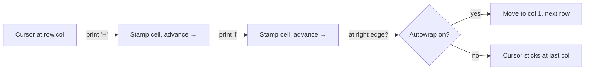
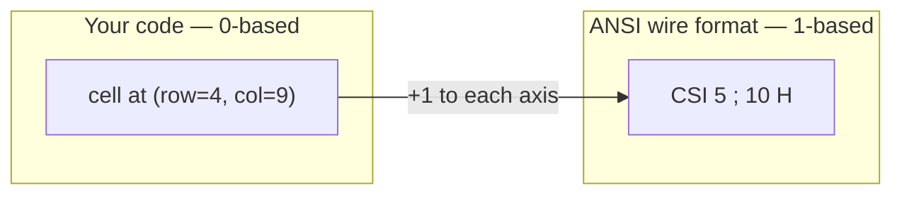
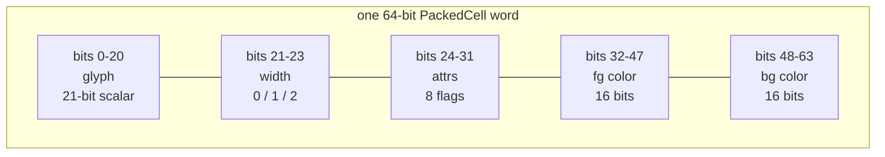
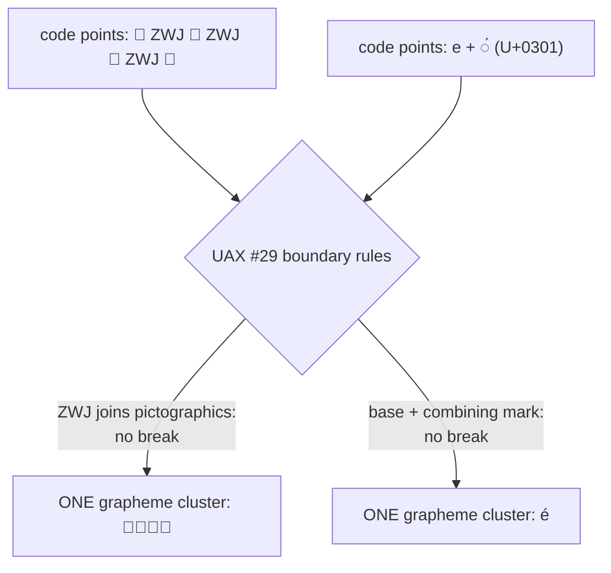
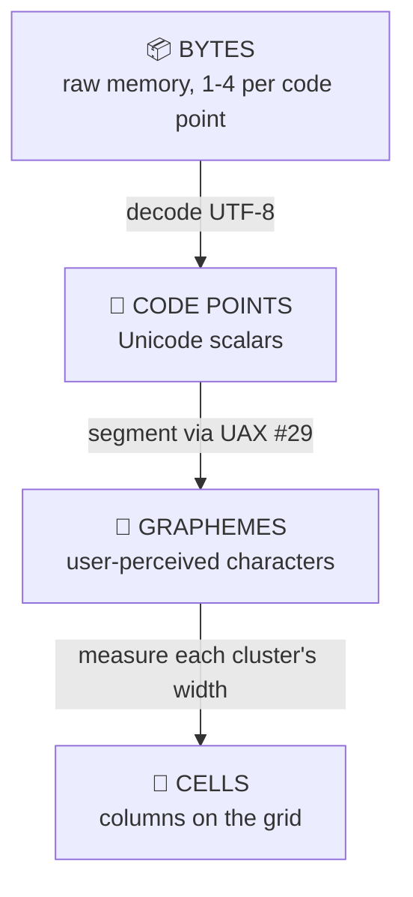

# The Cell Grid

!!! abstract "TL;DR"
    A terminal is a fixed **grid of cells**, like graph paper — every square holds one user-perceived character plus its color and style. The hard part is a deceptively simple question: **how many cells does a piece of text occupy?** The answer is *not* its byte count, *not* its code-point count, and *not even* its grapheme count — it's a **fourth** measurement that depends on Unicode width rules and on terminal behavior that was never fully standardized. ASCII is 1 cell, CJK is 2 cells, combining marks are 0 cells, emoji are usually 2 cells (until ZWJ sequences and "ambiguous-width" glyphs make terminals openly disagree). Get this right and your tables align, your borders close, and your layout engine is trustworthy. Get it wrong and everything looks *almost* aligned — which is somehow worse than obviously broken. **The fix:** measure in cells, use one consistent width table for both measuring and rendering.

In the previous page we established the foundational truth of terminal
programming: **a terminal is a grid of cells**. Not a canvas of pixels, not a
stream of words — a fixed grid where every square holds one character.

That single idea sounds simple enough to dismiss. It is not. Almost every hard
bug you will ever hit in a TUI traces back to one question that turns out to be
shockingly deep:

> *How many cells does this piece of text actually take up?*

You would think the answer is "count the characters." It is not. The answer
involves Unicode, East-Asian typography, decades-old terminal conventions,
emoji families holding hands, invisible joiner characters, and the fact that
two terminals looking at the *exact same bytes* will frequently disagree about
what they see.

This page is about the grid in detail — what one cell really holds, why
terminals demand monospace fonts, and the genuinely difficult problem of
**character width**. Get this right and your tables line up, your borders
close, and your layout engine is trustworthy. Get it wrong and everything looks
*almost* aligned.

---

## The grid, recapped

A terminal is `rows × columns` of cells. A typical window might be 80 columns
wide and 24 rows tall — the classic "80×24" you'll see referenced everywhere,
inherited from the punch-card and VT100 era.

```text
        col 1   2   3   4   5   6   7   8  ...  80
       ┌───┬───┬───┬───┬───┬───┬───┬───┬─────────┐
row 1  │ H │ e │ l │ l │ o │   │ W │ o │   ...   │
       ├───┼───┼───┼───┼───┼───┼───┼───┼─────────┤
row 2  │   │   │   │   │   │   │   │   │   ...   │
       ├───┼───┼───┼───┼───┼───┼───┼───┼─────────┤
 ...   │                                         │
       ├───┼───┼───┼───┼───┼───┼───┼───┼─────────┤
row 24 │ $ │ _ │   │   │   │   │   │   │   ...   │
       └───┴───┴───┴───┴───┴───┴───┴───┴─────────┘
```

Three properties define this grid, and every one of them matters later:

- **It is fixed.** A cell is a cell. You cannot put "half a character" in one,
  or let one character spill smoothly into the next. Text *snaps* to the grid.
- **The origin is the top-left.** Counting starts in the upper-left corner and
  runs right (columns) and down (rows). There is no negative space; you cannot
  draw above row 1 or left of column 1.
- **Cells are uniform in size.** Every square is the same number of pixels wide
  and tall. This is what makes a monospace font mandatory (more on that soon).

### The cursor is *state*

Somewhere on this grid lives the **cursor**: the position where the next
character you print will land. This is the single most important piece of
hidden state in terminal programming, so let's be precise about it:

1. The cursor has a position — a `(row, column)` on the grid.
2. When you print a character, it lands at the cursor and the cursor **advances**
   one cell to the right.
3. At the right edge, behavior depends on the terminal's *autowrap* mode: it
   usually wraps to column 1 of the next row.
4. Special characters move the cursor without printing: ++enter++ (newline)
   drops it down a row, ++tab++ jumps it to the next tab stop, ++backspace++
   moves it left one cell.

A huge amount of TUI work is, quite literally, *moving this cursor around and
stamping cells*. When you watch a progress bar fill or a spinner spin, what's
really happening is a program repositioning the cursor and overwriting cells in
place.



### A note on coordinates: 1-based vs 0-based

This trips up everyone, so let's be explicit. There are two coordinate systems
in play, and they disagree on where counting starts.

=== "ANSI escape codes (1-based)"

    **The top-left cell is row `1`, column `1`.** When you send the terminal
    "move the cursor to row 5, column 10," the numbers `5` and `10` count from
    one. This is a hardware-era convention baked into the escape sequences
    themselves (we cover these on the next page).

    ```text
    CSI 5 ; 10 H   →  cursor to row 5, column 10  (one-based)
    ```

=== "Your code (0-based)"

    **The top-left cell is index `[0][0]`.** A framework storing the grid in an
    array puts the first cell at index zero, because that's how arrays work in
    C, C++, Rust, and friends.

    ```cpp
    grid[0][0] = cell;   // top-left, zero-based
    ```

So a framework constantly **translates** between the two: an internal cell at
`(col=0, row=0)` becomes the escape sequence targeting `(1, 1)`.



!!! warning "Off-by-one is the house specialty"
    The 1-based/0-based seam is the single most common source of "everything is
    shifted one column to the left" bugs. When your output is offset by exactly
    one cell, suspect this conversion first. A good framework hides it entirely
    so you only ever think in one system — but when you're debugging raw escape
    codes by hand, keep both pictures in your head.

Also note the convention is usually **`(row, col)` in ANSI** but frequently
**`(x, y)` = `(col, row)` in graphics-flavored APIs**. Two values, two possible
orderings, two possible bases. Read your framework's docs and pick a mental
model — then never switch it mid-file.

??? note "Why is ANSI 1-based at all? A short history aside"
    The escape codes come from physical terminals like the DEC VT100 (1978),
    which were themselves modeled on teletypes and typewriters. Humans count
    "first row, first column," not "zeroth," so the wire protocol counted from
    one. Decades later, C popularized zero-based array indexing for pointer
    arithmetic reasons, and the two worlds were permanently out of step. Every
    TUI framework you'll ever use carries a `+1`/`-1` somewhere in its guts to
    reconcile them. It is a tiny, eternal tax paid at the boundary between human
    convention and machine convention.

---

## What one cell holds

A cell is not just "a letter." It is a small bundle of state. At minimum, a
single cell stores:

| Field | Example | Notes |
|-------|---------|-------|
| **Glyph** | `A`, `你`, `🦀` | The visible character — one *grapheme* (more on that word soon) |
| **Foreground color** | bright green | Color of the text itself |
| **Background color** | dark grey | Color behind the text |
| **Attributes** | bold, italic, underline, reverse, blink, strikethrough… | Style flags, often bit-packed |

So the letter in a single cell might really be "a bold, underlined, bright-green
`A` on a dark-grey background." All of that is the state of *one square* on the
grid. When a framework "redraws," it is reconciling thousands of these little
bundles against what's currently on screen and emitting escape codes only for
the ones that changed.

### The packed cell

A terminal grid is big. An 80×24 screen is 1,920 cells; a fullscreen 4K
terminal can be hundreds of thousands. A framework redraws this grid many times
per second, so each cell needs to be **compact** and cheap to copy and compare.
The usual trick is a *packed cell*: a small, fixed-size struct that holds
everything about one square in as few bits as possible.

Here's a generic, readable sketch — **not** any specific framework's layout,
just to make the idea concrete:

```cpp
#include <cstdint>

// Attribute flags, one bit each, OR'd together.
enum Attr : uint16_t {
    None      = 0,
    Bold      = 1 << 0,
    Dim       = 1 << 1,
    Italic    = 1 << 2,
    Underline = 1 << 3,
    Blink     = 1 << 4,
    Reverse   = 1 << 5,   // swap fg/bg
    Strike    = 1 << 6,
    // ... room for more
};

struct Cell {
    char32_t glyph;   // ONE grapheme as a Unicode scalar (UTF-32)
    uint32_t fg;      // 0xRRGGBB foreground
    uint32_t bg;      // 0xRRGGBB background
    uint16_t attrs;   // bitmask of Attr flags
    uint8_t  width;   // columns this cell occupies: 0, 1, or 2
};
```

That struct is *clear*, but it's also chunky (16+ bytes once aligned) and the
`glyph` field can't hold a multi-code-point grapheme like a ZWJ emoji. A
performance-minded renderer often goes further and squeezes the common case
into a single **64-bit word**, falling back to a side table only for the rare
fat graphemes. Here's the *idea* of how those 64 bits might be carved up:

```cpp
// ILLUSTRATIVE — packing one common-case cell into 64 bits.
// (Real frameworks vary; maya's exact layout is its own business.)
struct PackedCell {
    uint64_t bits;
    // [ 0..20]  glyph: 21-bit Unicode scalar (covers all of U+0..U+10FFFF)
    // [21..23]  width: 0, 1, or 2 cells
    // [24..31]  attrs: 8 style flag bits
    // [32..47]  fg:    16-bit palette index OR truecolor handle
    // [48..63]  bg:    16-bit palette index OR truecolor handle
};
```

And the same layout drawn as a bit-field map across the 64-bit word:



Read as a table, the same packing looks like this:

| Bits | Field | Width | Holds |
|:----:|-------|:-----:|-------|
| `0–20` | **glyph** | 21 bits | A Unicode scalar value (`U+0000`–`U+10FFFF` needs 21 bits) |
| `21–23` | **width** | 3 bits | Cell width: `0`, `1`, or `2` — the star of this page |
| `24–31` | **attrs** | 8 bits | Bold / italic / underline / reverse / … one bit each |
| `32–47` | **fg** | 16 bits | Foreground: palette index, or a handle into a truecolor table |
| `48–63` | **bg** | 16 bits | Background: same scheme as foreground |

!!! example "Why pack a cell into one word?"
    Two reasons, both about speed:

    - **Cache friendliness.** A redraw walks the *entire* grid. If each cell is
      one 64-bit word, a row of 80 cells is 640 bytes — a handful of cache
      lines, streamed linearly. Pointer-chasing into separate color/attr objects
      would thrash the cache and tank the frame rate.
    - **Fast comparisons.** Diffing two frames means asking "did this cell
      change?" thousands of times. If a cell is one word, the comparison is a
      single `==` on a 64-bit integer — and a SIMD lane can compare many cells
      at once. The renderer only emits escape codes for words that differ.

Notice the `width` field in every version above. Even at the level of a single
cell, we have to record **how many columns it occupies — 0, 1, or 2** — because,
as we're about to see, *not every glyph is one column wide*. That field is the
entire reason this page exists.

!!! note "Why `char32_t` / 21 bits and not `char`?"
    A `char` is one byte and can only hold ASCII (0–127). Real text is Unicode,
    and a single visible character can be a code point far above 127 (like `你`,
    `U+4F60`, or `🦀`, `U+1F980`). Storing the glyph as a wide scalar lets one
    cell hold any single code point. (Even this isn't quite enough for the
    gnarliest emoji — a ZWJ family is *seven* scalars — which is exactly why
    real renderers keep a side table for "fat" graphemes. We'll get there.)

---

## Why terminals are monospace

Open a word processor and type `iiii` then `mmmm`. The `m`s take up far more
horizontal space than the `i`s, because the font is **proportional** — each
glyph is as wide as it needs to be. That's beautiful for prose and a disaster
for a grid.

Terminals assume a **monospace** (fixed-width) font: every character occupies
exactly the same cell box. `i` and `m` and `W` all get one identical cell.

```text
Proportional (a word processor):       Monospace (a terminal):

 i i i i                                ┌─┬─┬─┬─┐
 m m m m                                │i│i│i│i│
 ↑ wildly different widths              ├─┼─┼─┼─┤
                                        │m│m│m│m│
                                        └─┴─┴─┴─┘
                                        ↑ identical cells
```

This is not an aesthetic choice — it's structural. The entire grid model
*depends* on a glyph fitting predictably into a cell. If glyph widths varied per
character, the columns would no longer line up and the concept of "column 40"
would be meaningless.

!!! warning "Proportional fonts break the grid"
    If you (or your user) configure the terminal with a proportional font,
    columns drift out of alignment, box-drawing characters develop gaps, and
    ASCII art turns to mush. This is why "pick a monospace font" is rule one of
    terminal setup, and why fonts ship in dedicated coding variants (Fira
    **Code**, JetBrains **Mono**, Cascadia **Mono**). The word *Mono* in the
    name is a promise about cell width.

So far so good: monospace gives every character one equal box. Except — and
here's where the floor drops out — **some characters legitimately need two
boxes, and some need zero.** Monospace fixes the *box* size; it does not make
every character occupy exactly one box.

---

## The width problem

This is the heart of the page. The question "how wide is this text?" has no
single easy answer, because different characters claim different numbers of
cells. Let's build it up case by case.

### Case 1: ASCII — one cell 

The easy case. Every printable ASCII character (`A`–`Z`, `a`–`z`, `0`–`9`,
punctuation, space) is exactly **one cell wide**. For decades this was the whole
story, and a lot of old code still assumes "one byte = one character = one
cell." That assumption is wrong the moment you leave ASCII.

### Case 2: East-Asian wide characters — two cells 

Chinese, Japanese, and Korean (collectively **CJK**) characters are visually
*square* — about as tall as they are wide. To keep them readable, terminals
render them at **two cells wide**.

```text
"Hi你好" laid out on the grid:

┌───┬───┬───────┬───────┐
│ H │ i │   你  │   好  │
└───┴───┴───────┴───────┘
  1   1     2       2      = 6 cells, but only 4 "characters"
```

So `你好` ("hello" in Chinese) is **two characters but four cells**. The Unicode
standard formalizes this with the **East Asian Width** property: characters are
classed as `Wide`, `Fullwidth`, `Narrow`, `Halfwidth`, `Ambiguous`, or
`Neutral`. `Wide` and `Fullwidth` characters take two cells; most others take
one.

| EAW class | Meaning | Typical cells |
|-----------|---------|:-------------:|
| `Narrow` (`Na`) | Standard Western characters | 1 |
| `Halfwidth` (`H`) | Half-width forms (e.g. `ｱ`) | 1 |
| `Wide` (`W`) | CJK ideographs, many emoji | 2 |
| `Fullwidth` (`F`) | Full-width forms (e.g. `Ａ` `１`) | 2 |
| `Neutral` (`N`) | Most other scripts | 1 |
| `Ambiguous` (`A`) | Depends on locale/context | **1 or 2** ⚠️ |

That `Ambiguous` row is a foreshadowing of pain. Hold that thought.

### Case 3: Combining marks — zero cells 

Some code points don't occupy any cell of their own — they *modify* the
preceding character. The classic example is the accented `é`. There are two ways
to encode it:

| Form | Code points | Bytes (UTF-8) | Cells |
|------|-------------|:-------------:|:-----:|
| Precomposed `é` | `U+00E9` | 2 | 1 |
| Decomposed `é` | `U+0065` (`e`) + `U+0301` (combining acute) | 3 | 1 |

In the decomposed form, the combining accent `U+0301` is **zero cells wide**: it
stacks onto the `e` rather than taking its own square. Visually both forms look
identical — a single `é` in a single cell — but one is *one* code point and the
other is *two*.

```text
"e" + "◌́"  renders as  "é"   ← two code points, ZERO extra cells, one square
```

Combining marks are everywhere: accents, diacritics, the marks that build
Vietnamese, Hindi (Devanagari), Arabic, Thai. A naive "count the code points"
width calculation overcounts every one of them. (And a malicious one can stack
*dozens* of combining marks on a single base character — the so-called "Zalgo"
text — which is still, by the rules, occupying just one cell.)

### Case 4: Emoji — two cells, and then it gets weird 

Emoji are typically rendered **two cells wide**, like CJK characters (they're
square and pictorial). `🦀` takes two cells. Fine. But emoji are where Unicode's
composition machinery goes into overdrive. Four mechanisms stack on top of each
other:

**a) Skin-tone modifiers.** A waving hand `👋` (`U+1F44B`) can be followed by a
skin-tone modifier `🏽` (`U+1F3FD`) to produce `👋🏽`. That's **two code points**
combining into **one visible glyph**, still two cells wide.

**b) Variation selectors (text vs. emoji presentation).** Some characters can be
*either* a plain text glyph or a colorful emoji, and an invisible **variation
selector** picks which. `U+FE0E` (VS15) forces **text** presentation; `U+FE0F`
(VS16) forces **emoji** presentation. The heart `❤` is the classic case:

| Sequence | Code points | Looks like | Likely cells |
|----------|-------------|:----------:|:------------:|
| `❤` alone | `U+2764` | text heart `❤︎` | often 1 |
| `❤️` (heart + VS16) | `U+2764 U+FE0F` | emoji heart | often 2 |

The variation selector itself is zero-width, yet it can *change the width of the
character before it* by flipping it from a 1-cell text glyph to a 2-cell emoji.
Delightful.

**c) Regional indicators (flags).** A flag is **two** "Regional Indicator
Symbol" letters. The flag of Japan `🇯🇵` is `U+1F1EF` (🇯) + `U+1F1F5` (🇵) — the
regional letters `J` and `P`. Two code points, one flag, two cells *if* the
terminal pairs them; an unaware terminal shows two boxed letters instead.

**d) ZWJ sequences — the boss fight.** A *Zero-Width Joiner* (ZWJ, `U+200D`)
glues emoji together into a single grapheme. The family emoji `👨‍👩‍👧‍👦` is built
from:

```text
👨  (man)        U+1F468
ZWJ             U+200D     ← zero-width joiner, invisible
👩  (woman)      U+1F469
ZWJ             U+200D
👧  (girl)       U+1F467
ZWJ             U+200D
👦  (boy)        U+1F466
```

That is **seven code points** (`👨` ZWJ `👩` ZWJ `👧` ZWJ `👦`), 25 bytes in
UTF-8, forming **one** visible emoji that *should* occupy **two cells** — if the
terminal understands the sequence. Many terminals don't, and render it as four
separate two-cell emoji jammed together, blowing your layout to bits.

!!! tip "One grapheme, many code points"
    The family emoji is the perfect illustration of the gap between a
    **grapheme** (one user-perceived character) and a **code point** (one
    Unicode scalar). Seven code points, one grapheme. Your width logic has to
    reason about graphemes, not code points — but terminals vary in how well
    they actually do this.

### Grapheme segmentation (UAX #29), conceptually

How does a program know that `👨‍👩‍👧‍👦` is *one* grapheme and not seven? Unicode
defines the rules in **Annex #29 — Text Segmentation (UAX #29)**. You do not
need to memorize it, but the mental model is worth having:

- Text is a stream of code points.
- UAX #29 defines **boundary rules** that decide where one "grapheme cluster"
  ends and the next begins — i.e. where a human would say one character stops
  and another starts.
- The rules say things like *"don't break between a base character and a
  following combining mark,"* *"don't break across a ZWJ that joins two
  extended-pictographic emoji,"* and *"keep a base together with its
  variation selector and skin-tone modifier."*



So the pipeline a width-aware framework runs is: **decode bytes → code points →
segment into grapheme clusters (UAX #29) → measure each cluster's cell width.**
Only the last step gives you the number layout actually needs.

### The four lengths of a string

Here is the punchline of the whole page. Any non-trivial string has **four
different "lengths,"** and they routinely disagree:

1. **Bytes** — how many bytes it occupies in memory (depends on encoding;
   UTF-8 uses 1–4 bytes per code point).
2. **Code points** — how many Unicode scalars it contains.
3. **Grapheme clusters** — how many *user-perceived characters* it has (what a
   human would call "the letters").
4. **Cells** — how many columns it occupies on the terminal grid. **This is the
   one layout cares about.**



Notice the reductions: each arrow generally *shrinks* the count (bytes ≥ code
points ≥ graphemes), but the last step can go *back up* — a single grapheme can
be 2 cells. The four numbers are not even monotonic.

Let's measure one carefully chosen string against all four. The string is:

```text
A你é👨‍👩‍👧‍👦
```

That's: an ASCII `A`, the CJK character `你`, a decomposed `é` (`e` +
combining acute), and the family emoji.

| Piece | Bytes (UTF-8) | Code points | Graphemes | Cells |
|-------|:-------------:|:-----------:|:---------:|:-----:|
| `A` | 1 | 1 | 1 | 1 |
| `你` | 3 | 1 | 1 | 2 |
| `é` (`e`+◌́) | 3 | 2 | 1 | 1 |
| `👨‍👩‍👧‍👦` | 25 | 7 | 1 | 2 |
| **Total** | **32** | **11** | **4** | **6** |

Read that bottom row again. The **same string** is simultaneously:

- **32 bytes** long,
- **11 code points** long,
- **4 graphemes** long,
- and occupies **6 cells** on screen.

Four numbers, all correct, all different. If you ask `strlen()` you get bytes.
If you ask most languages' `.length` you get code points (or worse, UTF-16
units). Neither one tells you how many columns to reserve. **Only the cell count
does** — and computing it requires understanding grapheme clustering *and* the
width of each cluster.

```text
The string A你é👨‍👩‍👧‍👦 on the grid (6 cells):

┌───┬───────┬───┬───────┐
│ A │   你  │ é │  👨‍👩‍👧‍👦   │
└───┴───────┴───┴───────┘
  1     2     1     2
```

### `wcwidth`, East Asian Width, and why terminals disagree

How does a program figure out a character's cell width? The traditional tool is
the C function **`wcwidth()`** (and `wcswidth()` for whole strings). Given a wide
character, it returns:

| Return | Meaning |
|:------:|---------|
| `0` | Combining / zero-width character |
| `1` | Normal, single-cell character |
| `2` | Wide (CJK / fullwidth) character |
| `-1` | Control character or non-printable |

`wcwidth` consults a table derived from Unicode's **East Asian Width** property.
In principle, every terminal and every program could share one table and always
agree. In practice, they emphatically do not, for several big reasons:

**1. The `Ambiguous` category.** Remember that East Asian Width class? Some
characters — certain box-drawing glyphs, Greek letters, Cyrillic, and others —
are marked `Ambiguous`: one cell wide in a Western context, two cells in an
East-Asian context. Terminals pick a side, and they pick differently (often
controlled by a setting literally named *"ambiguous-width characters"*). A
character that's one cell in your terminal might be two cells in your user's.

**2. Emoji width, the eternal argument.** Are emoji one cell or two? Unicode's
guidance and real terminals have shifted over time. Modern terminals usually
render emoji at two cells; older or minimalist ones render many of them at one
cell.

**3. ZWJ awareness.** Whether a terminal even *recognizes* a ZWJ sequence as a
single grapheme varies wildly. So the literal same bytes (`👨‍👩‍👧‍👦`) might be
counted very differently depending on who's looking:

=== "Modern, ZWJ-aware terminal"

    Recognizes the whole sequence as one grapheme and renders one family emoji.

    ```text
    [👨‍👩‍👧‍👦]   ← width reported: 2 cells
    ```

=== "Older terminal (no ZWJ)"

    Ignores the joiners and stamps each emoji separately — four 2-cell emoji.

    ```text
    [👨👩👧👦]   ← width reported: 8 cells (4 × 2)
    ```

=== "Minimal / narrow-emoji terminal"

    Renders each emoji at one cell and ignores joiners.

    ```text
    [👨👩👧👦]   ← width reported: 4 cells (4 × 1)
    ```

The same 25 bytes, three different screen widths. That single picture *is* the
width problem.

!!! warning "This is a real, daily source of misaligned UIs"
    When a terminal and your program disagree by even one cell on one
    character, **every cell *after* it on that row is shifted.** Borders don't
    close. Table columns stagger. A status bar's right-aligned clock drifts left
    by one. The text is fine; the *width bookkeeping* desynced. There is no
    perfect, universal fix — the best frameworks ship their own well-tested
    width tables, follow Unicode's recommendations closely, and (crucially) use
    the **same** table for measuring and for rendering so they're at least
    internally consistent.

??? note "A concrete misalignment, side by side"
    Here is the *same data* rendered two ways. Both attempt a two-column table
    where the right column is padded to a fixed visible width. The left version
    measured `你好世界` as if it were 4 units wide (its code-point count); the
    right version measured it correctly as 8 cells.

    ```text
    Measured as code points (WRONG)     Measured in cells (RIGHT)
    ┌────────┬────────────┐             ┌────────┬────────────┐
    │ name   │ greeting   │             │ name   │ greeting   │
    ├────────┼────────────┤             ├────────┼────────────┤
    │ Alice  │ 你好世界       │          │ Alice  │ 你好世界   │
    │ Bob    │ hello      │             │ Bob    │ hello      │
    └────────┴────────────┘             └────────┴────────────┘
              ↑ right border bulges                ↑ closes cleanly
                — 你好世界 is really
                8 cells, padded as 4
    ```

    The text is *identical*. Only the width arithmetic differs — and that alone
    is the difference between a clean table and a broken one.

---

## How a framework handles this (in general)

You've seen the problem. Here's the shape of the solution that robust TUI
frameworks converge on. None of this is maya-specific API — it's the general
playbook.

- **Measure everything in cells, never bytes or code points.** Layout math —
  padding, centering, wrapping, truncation — operates on cell counts produced by
  a single width function. `len(s)` is *never* the right input.
- **Segment into graphemes first.** Before measuring, group code points into
  grapheme clusters (UAX #29). Width is asked *per cluster*, so a ZWJ family or
  an `e`+accent is measured as one unit, not picked apart.
- **Keep one width table, used everywhere.** The same table that *decides* how
  wide a glyph is must also drive *how many cells the renderer reserves* for it.
  If measuring and rendering use different tables, they desync — the cardinal
  sin.
- **Snap wide-character boundaries when diffing.** A 2-cell glyph occupies a
  cell *and* its right neighbor (often stored as a "continuation" / phantom
  cell). When the renderer diffs frames and emits updates, it must treat that
  pair atomically — you cannot redraw the right half of a wide character alone
  without corrupting the display. Cursor moves and clears must land on cluster
  boundaries, not in the middle of a wide glyph.
- **Truncate and wrap on cluster + cell boundaries.** Cutting a string to fit
  *N* cells must never slice a wide character in half or strand a combining mark
  on its own. The framework accumulates cell width and breaks only at safe
  points, appending `…` if it had to cut.
- **Decide an emoji/ambiguous policy and apply it consistently.** Pick a stance
  on emoji and ambiguous-width characters, document it, and (ideally) let it be
  configured to match the user's terminal — but apply *that one* stance
  uniformly.

The payoff: you, the application author, get to hand the framework `"你好"` or
`"👋🏽"` or a ZWJ family and trust that padding, borders, and alignment still hold.

!!! tip "What good frameworks do for you"
    A solid TUI framework (maya included) measures text in cells internally, so
    you can hand it `"你好"` or `"👋🏽"` and trust that layout, padding, and
    borders still line up. You think in terms of *widgets and content*; the
    framework sweats the grapheme clustering and width tables underneath. That's
    a lot of the value — turning the four-lengths nightmare into "just print
    text and it works."

---

## Why this matters for layout

Pull it all together. A TUI framework's whole job is placing text on the grid so
that columns line up. To do that it must answer "how wide is this?" in **cells**
— never bytes, never code points.

Consider drawing a simple bordered table. The framework decides a column is 10
cells wide, then pads each entry to fill it:

```text
Measured in BYTES (wrong):              Measured in CELLS (right):

┌──────────┬──────────┐                 ┌──────────┬──────────┐
│ Alice    │ 你好世界  │                │ Alice    │ 你好世界 │
│ Bob      │ hello    │                 │ Bob      │ hello    │
└──────────┴──────────┘                 └──────────┴──────────┘
            ↑ "你好世界" is 12 bytes,                ↑ "你好世界" is 8 cells,
              padded to 10 bytes → too                 padded to 10 cells → lines
              short, border misaligns                  up perfectly
```

If the framework measures `你好世界` as 12 (its byte length) it pads to the
wrong amount and the right border jumps out of alignment. If it measures it as 4
(its code-point/grapheme count) it pads two cells too far. Only measuring it as
**8 cells** produces a table that closes cleanly.

Everything alignment-related rides on this:

- **Tables** — column widths, padding, truncation.
- **Borders and boxes** — the corners only meet if every
  row is exactly the same cell width.
- **Centering and right-alignment** — "center in
  40 cells" needs the text's true cell width.
- **Truncation with `…`** — cutting a string to fit
  *N* cells must not slice a wide character in half or strand a combining mark.
- **Word wrapping** — deciding where a line breaks depends on
  accumulated cell width, not character count.

---

## Try it yourself

You don't need a framework to *see* the width problem. A plain terminal is
enough. The gap between "how many bytes" and "how wide on screen" becomes
visible immediately.

**1. Bytes vs. code points vs. cells.** Print two CJK characters and ask the
shell to count them three ways:

```bash
echo -n "你好" | wc -c      # 6  ← BYTES (each CJK char is 3 bytes in UTF-8)
echo -n "你好" | wc -m      # 2  ← CHARACTERS (code points)
# ...but on screen, 你好 occupies 4 CELLS. No standard
# coreutil reports that — cell width is a terminal concept.
```

Three different numbers for the same two characters: **6 bytes, 2 code points, 4
cells.**

**2. Watch alignment break.** Print rows where some entries are ASCII and some
are CJK or emoji, padding each to the same *character* count with `printf`:

```bash
printf '|%-6s|\n' "abc"
printf '|%-6s|\n' "你好"
printf '|%-6s|\n' "👋🦀"
```

You'll likely see something like this — the right-hand `|` does **not** line up,
because `printf`'s `%-6s` pads to a fixed number of *bytes-ish units*, not cells:

```text
|abc   |
|你好    |
|👋🦀    |
↑ borders fail to align — the classic symptom
```

The ASCII row is correct. The CJK and emoji rows are off, because each wide
glyph eats two cells but `printf` only "spent" one unit of padding budget on it.
This is the exact bug a width-aware layout engine exists to prevent.

**3. See a grapheme that's many code points.** Count the family emoji and watch
the numbers diverge:

```bash
printf '%s' "👨‍👩‍👧‍👦" | wc -c   # 25 ← BYTES
printf '%s' "👨‍👩‍👧‍👦" | wc -m   #  7 ← CODE POINTS (4 emoji + 3 ZWJ)
# ...but it's 1 grapheme and *should* be 2 cells.
```

**4. Provoke the ambiguity.** Print a ZWJ emoji and stare at how *your* terminal
handles it:

```bash
printf '[👨‍👩‍👧‍👦]\n'
```

If your terminal is modern and ZWJ-aware, you'll see one family emoji snug
between the brackets. On an older terminal you may see four separate people, or
gaps, or boxes — the same bytes, rendered at a different width. Try it in two
different terminal emulators and you may get two different pictures. **That
divergence, in one screenshot, is the whole reason text width is hard.**

!!! note "The takeaway"
    A terminal is a grid of cells. Each cell holds one grapheme plus color and
    attributes, often packed into a single 64-bit word for speed. The deep
    problem is that **the number of cells a string occupies is not its byte
    length, not its code-point count, and not even its grapheme count** — it's a
    fourth measurement that depends on Unicode width rules and on terminal
    behavior that isn't fully standardized. Measure in cells, segment into
    graphemes first, use one consistent width table for measuring *and*
    rendering, and your UIs line up.

---

## What's next

We now know *what* lives in each cell and *how much room* text really takes.
The next question is: how do we actually tell the terminal to move the cursor,
set those colors, flip those attribute bits, and stamp cells where we want them?

The answer is a tiny, cryptic language the terminal has spoken since the 1970s —
the same VT100-era convention that gave us 1-based coordinates.

Head to **[ANSI Escape Codes](ansi-escape-codes.md)** to learn the control
sequences that drive the grid — moving the cursor, painting color, and clearing
the screen.
