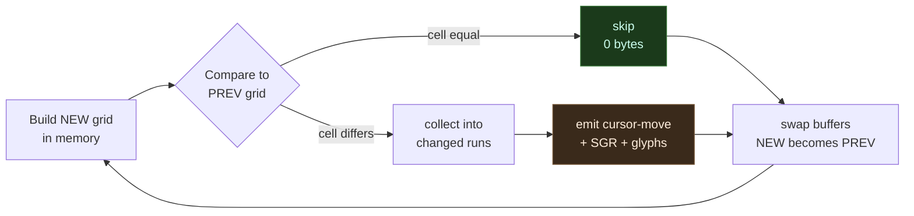
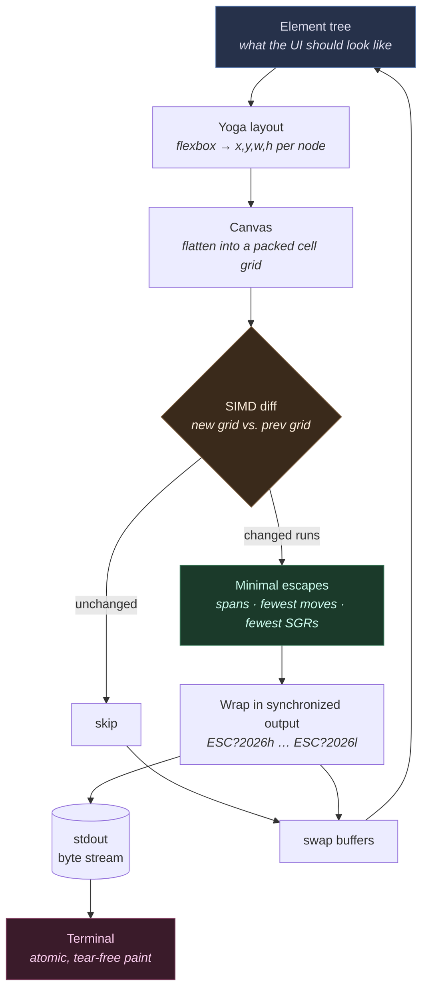

# The Rendering Problem

!!! abstract "TL;DR"
    A terminal has no framebuffer — only a one-way pipe of bytes that act as
    commands. The naive way to draw a UI (clear the screen, repaint everything,
    repeat) produces three failures at once: **flicker** (the screen goes blank
    between erase and redraw), **tearing** (a half-drawn frame is visible), and
    **cost** (you ship the entire screen — kilobytes — every frame, which is
    brutal over SSH).

    The cure is **double buffering + diffing**: build the next frame into an
    off-screen cell grid, compare it to the previous grid, and emit escape codes
    for *only the cells that changed* — for a ticking clock that's ~112 bytes
    instead of ~1238, an **11× reduction**. Layer on **run-length spans**
    (batch adjacent changed cells), **SGR minimisation** (don't restate the
    pen), **synchronized output** (DEC 2026 — land the frame atomically),
    **cursor/state hygiene**, and a **SIMD-fast diff** that stays inside the
    ~16 ms frame budget. Real terminals add a **compatibility tax**: resize
    mid-frame, wide chars on diff boundaries, cursor mis-tracking, inline
    scrollback. Everything in maya's renderer exists to answer one question:
    *how do I write fewer bytes, safely?*

You now know the three things a terminal gives you: a **grid of cells**, a
stream of **ANSI escape codes** to paint that grid, and a trickle of **input
bytes** coming back. With those pieces you could, in principle, draw any UI you
like. So let's try the obvious thing — and watch it fall apart.

This page is about *why* drawing a UI on a terminal is genuinely hard, and the
handful of techniques that turn a stuttering, flickering mess into something
that feels as smooth as a native app. Everything maya's renderer does exists to
solve the problems on this page. Once you've *felt* the problems, the
architecture in the next page will read like the only sane response.

---

## The naive approach

Here is the first program everyone writes. A clock, redrawn once a second:

```text
loop forever:
    clear the screen          # ESC[2J
    move cursor to home       # ESC[H
    print the whole UI        # every row, every cell
    sleep until next frame
```

In raw escape codes, one frame looks like this:

```text
ESC[2J            <- erase entire screen
ESC[H             <- cursor to row 1, col 1
"┌─ clock ──────────────┐\r\n"
"│  14:32:08            │\r\n"
"└──────────────────────┘\r\n"
```

It works. You run it, you see a clock, you feel clever. Then you actually *look*
at it, and you notice three separate things wrong — and the bigger your UI gets,
the worse all three become.

### Problem 1: Flicker

`ESC[2J` erases the screen *immediately*. Your redraw arrives a few milliseconds
later. In the gap between "screen is now blank" and "screen is painted again,"
the terminal is showing you **nothing** — a blank rectangle.

Do that 60 times a second and the display spends a meaningful slice of every
frame empty. Your eyes integrate those blank moments into a visible shimmer.
That's flicker, and it's the single most recognisable mark of an amateur TUI.

```text
frame N        gap            frame N+1
┌──────────┐   ┌──────────┐   ┌──────────┐
│ 14:32:08 │ → │          │ → │ 14:32:09 │
└──────────┘   └──────────┘   └──────────┘
   visible       BLANK          visible
                (flicker)
```

The cruel part: the gap is *invisible in the source*. Your code looks correct —
erase, then draw. The blankness lives in the few milliseconds of wall-clock time
between the two `write()` calls reaching the terminal, which is exactly where a
debugger can't help you.

### Problem 2: Tearing

The terminal doesn't wait for your whole frame to arrive before it starts
drawing. It paints bytes as they stream in. If your redraw takes longer than a
single display refresh — or the OS schedules you out halfway through the
`write()` — the screen shows the **top half of the new frame and the bottom half
of the old one** at the same time.

```text
what you wrote          what the user saw (caught mid-write)
┌──────────────┐        ┌──────────────┐
│ row 1 (new)  │        │ row 1 (new)  │
│ row 2 (new)  │        │ row 2 (new)  │  ← refresh fired HERE
│ row 3 (new)  │        │ row 3 (OLD)  │
│ row 4 (new)  │        │ row 4 (OLD)  │
└──────────────┘        └──────────────┘
                            the seam = tearing
```

That seam is *tearing*. On a clock it's subtle. On a scrolling list or an
animation it looks like the UI is being ripped in two.

### Problem 3: It's slow

This is the one that really bites, and it's the least obvious. Look at what the
naive loop sends every single frame: **the entire screen.** An 80×24 terminal is
**1,920 cells**. With styling — colours, bold, the escape codes that set them —
a full repaint is easily **several KB of bytes on the wire, every frame.**

For a clock where *one digit changed*, you just sent thousands of bytes to
update three of them.

!!! warning "This is brutal over SSH"
    On a local terminal you might not notice — the bytes never leave the
    machine. Open the same app over SSH on hotel Wi-Fi, or a mosh session to a
    box three continents away, and the naive approach becomes unusable. Every
    keystroke triggers a full-screen repaint that has to crawl down a 200 ms
    link. The UI feels like it's moving through syrup. At 60 fps, a ~5 KB frame
    is **300 KB/s of pure redraw** — for a clock. TUIs live and die on slow
    links, and the naive renderer dies first.

=== "Naive re-emit"

    ```text
    every frame, unconditionally:
      ESC[2J          erase everything
      ESC[H           home the cursor
      <1,920 cells>   repaint the whole grid, styles and all
    → kilobytes, 60× per second, forever
    ```

    Cost scales with the **size of the screen**. A bigger terminal is a
    *slower* app, even if nothing on it moved.

=== "Cell diff"

    ```text
    every frame:
      build next grid in memory (no terminal I/O)
      compare to previous grid
      emit only changed cells:
        ESC[2;22H 9   ← one move, one glyph
    → a handful of bytes when little changed
    ```

    Cost scales with the **size of the change**. A bigger terminal with the same
    update costs the same. This is the whole game.

---

## The real bottleneck: bytes on the wire

Here's the mental model that makes everything else click into place.

**A terminal is driven entirely by a byte stream.** You don't have a framebuffer
you can poke pixels into. You have one pipe — stdout — and the only thing you can
do is write bytes to it. Those bytes are *commands*: move the cursor, set a
colour, draw this glyph. The terminal reads them in order and obeys.

The cost of a frame is, to a very good approximation, **proportional to the
number of bytes you write.** Parsing them, applying styles, laying out glyphs,
and — crucially — *transmitting* them over whatever connection sits between your
program and the screen.

Let's make it visceral. Here is the cost of a single clock tick — `14:32:08` →
`14:32:09`, one digit changed — counted to the byte:

| Frame technique | What gets written | Bytes/frame | vs. diff |
|---|---|---|---|
| Naive full repaint, plain | `ESC[2J` + `ESC[H` + 24 rows × glyphs + line ends | **~1,238** | 11× |
| Naive full repaint, styled | …plus an SGR per styled run | **~3,000+** | 27×+ |
| Diff, per-cell | `ESC[2;22H` (8 B) + `9` (1 B) | **~9** | — |
| Diff, realistic frame (a few widgets ticked) | a few moves + spans + 1–2 SGRs | **~112** | baseline |

The naive renderer sends ~1,238 bytes to change one digit; a diffing renderer
sends ~9–112 depending on how much really moved. At 60 fps that's the difference
between **~74 KB/s** and **under 7 KB/s** — roughly an **11× reduction** on a
realistic frame, and far more on a quiet one.

!!! tip "Write less. That's the whole game."
    Almost every rendering technique in this document is a different answer to a
    single question: *how do I send fewer bytes?* Diffing sends fewer bytes.
    Span batching sends fewer bytes. Minimising style transitions sends fewer
    bytes. Synchronized output doesn't shrink the bytes but makes the few you
    send land cleanly. Keep that lens and the rest of the page is just tactics.

The naive renderer fails because it has the worst possible answer: it sends
*every* byte, *every* frame, forever. We need a renderer that sends only what
actually changed.

---

## The key idea: double buffering + diffing

This is the most important rendering technique in all of TUI development. If you
take one thing from this page, take this.

Keep **two** cell grids in memory:

- the **front buffer** — what's currently on screen,
- the **back buffer** — the frame you're about to draw.

Each frame, you build the new UI into the back buffer *without touching the
terminal at all*. Then you **compare the two buffers cell by cell** and emit
escape codes only for the cells that actually differ. Finally you swap: the back
buffer becomes the new front buffer, ready for next time.



No clear. No full repaint. The screen is *never blanked*, so there's nothing to
flicker. And we sent almost nothing.

### Walk through the clock

Watch the bytes. The clock ticks from `14:32:08` to `14:32:09`. Lay the two
grids side by side and the diff is trivial:

```text
        FRONT (on screen)            BACK (next frame)
        ┌───────────────────┐        ┌───────────────────┐
        │ 1 4 : 3 2 : 0 8   │        │ 1 4 : 3 2 : 0 9   │
        └───────────────────┘        └───────────────────┘
          = = = = = = = ≠              every cell equal except
                        ▲              the seconds' ones digit
                        └── 8 → 9 at row 2, col 22
```

The diff finds exactly one changed cell. So the renderer emits:

```text
ESC[2;22H     <- move cursor to that one cell (row 2, col 22)   8 bytes
9             <- write the new glyph                            1 byte
```

That's it. Roughly **9 bytes** instead of a full-screen repaint. The style
didn't change, so we don't even re-send the colour codes — the terminal's
current pen is already correct.

That is not a small win. That is the difference between "toy" and "tool." A
diffing renderer routinely sends **two to three orders of magnitude** fewer bytes
than a naive one on a typical UI update, because typical UI updates change a tiny
fraction of the screen.

??? note "Why it's called *double* buffering"
    The term comes from graphics: you draw into an off-screen buffer, then
    present it all at once, so the viewer never sees a half-drawn frame. In a
    TUI the "presentation" step is the diff — but the principle is identical.
    You never let the terminal see work-in-progress. The "two buffers" are the
    front (on screen) and the back (being built); after each frame you swap their
    roles rather than allocating new ones, so steady-state rendering does **zero
    allocation**.

---

## Run-length and span optimization

Diffing tells you *which* cells changed. But naively, you might emit a separate
"move cursor, write glyph" pair for each one. If a whole word changed, that's a
cursor move before every single character — and cursor-move escape codes
(`ESC[row;colH`) are *expensive*: 6–10 bytes each, far more than the glyph
they precede.

The fix is to **batch adjacent changed cells into spans.** If columns 10 through
14 all changed and they share the same style, you move the cursor *once* and
write all five glyphs in a single run:

=== "Per-cell (wasteful)"

    ```text
    ESC[5;10H H   ESC[5;11H e   ESC[5;12H l   ESC[5;13H l   ESC[5;14H o
    └── 5 cursor moves (≈ 8 B each) + 5 glyphs ≈ 45 bytes
    ```

    Every move re-states a position the cursor would have reached anyway by
    simply *advancing* after the previous glyph. Pure waste.

=== "Span-batched (lean)"

    ```text
    ESC[5;10H Hello
    └── 1 cursor move + 5 glyphs ≈ 13 bytes
    ```

    Move once, then let the terminal's natural left-to-right advance carry the
    cursor across the run. ~3.5× fewer bytes for this fragment alone.

Style transitions cost bytes too. Every time the *pen* changes — a new colour, a
toggle of bold — you have to emit an SGR sequence (`ESC[1;38;5;201m` and
friends), which can be a dozen-plus bytes. So a good renderer also tries to
**minimise style changes**: it tracks the terminal's current pen and only emits
an SGR when the next cell genuinely needs a different one. Cells that share a
style get written under one SGR, no re-statement in between.

So the real diff output isn't "a list of changed cells." It's an optimised plan:

- the **fewest cursor moves** — batch runs, and skip the move entirely when the
  cursor already landed in the right place after the previous write;
- the **fewest SGR changes** — coalesce same-styled runs and track the current
  pen so you never restate a style that's already active;
- only the glyphs that genuinely differ.

| Technique | What it removes | Typical saving |
|---|---|---|
| Cell diff | unchanged cells | up to ~99% on quiet frames |
| Run-length spans | redundant cursor moves between adjacent cells | ~6–9 B per skipped move |
| SGR coalescing | redundant style declarations | ~5–15 B per skipped SGR |
| Cursor-advance elision | the move when the pen is already in place | one whole move |

!!! tip "Two layers of laziness"
    Diffing is "don't redraw cells that didn't change." Span batching is "and
    for the cells that *did*, don't waste bytes moving and re-styling between
    them." Together they squeeze the byte stream down to something close to the
    theoretical minimum.

---

## Alt screen vs. inline rendering

Full-screen apps — editors, dashboards, file managers — want the *whole*
terminal as a clean canvas, and they want your shell exactly as you left it when
they exit. The terminal gives you a dedicated mechanism for this: the **alternate
screen buffer.**

```bash
ESC[?1049h    # switch TO the alternate screen (blank, saves your shell)
# ... app runs here on a clean canvas ...
ESC[?1049l    # switch BACK (restores your scrollback, untouched)
```

When you enter the alt screen, the terminal stashes your current screen and
scrollback and hands you a fresh, empty one. When you leave, it throws away
everything you drew and restores the original. This is why `vim` and `htop` can
take over your whole window and then vanish without a trace — your command
history and scrollback are exactly where they were.

But not every app wants to seize the whole screen. Some want to draw a block of
UI *below your prompt* and update it in place while the surrounding scrollback
stays put — think a build tool with a live progress region, or a coding assistant
that streams output and keeps a status panel pinned at the bottom. That's
**inline mode**, and it is a fundamentally harder beast.

| | Alt screen | Inline |
|---|---|---|
| Canvas | clean, blank, fully yours | shared with the shell + scrollback |
| Bounds | the whole terminal, fixed | a region that can grow and shrink |
| Cursor origin | known (row 1, col 1) | wherever the prompt happens to be |
| Risk of a bug | a glitch *inside* your app | **permanent corruption** of the user's history |
| Scroll | irrelevant — you own the screen | output above can scroll you out from under your own anchor |
| Exit | one escape restores everything | you must leave the region intact and the cursor sane |
| Examples | `vim`, `htop`, `less` | progress bars, `git` status spinners, coding assistants |

Inline is harder for a concrete reason: **there is no clean canvas.** You're
sharing the screen with the shell and with whatever scrolls past, so you must
track exactly where your region starts. The region can **grow** — add a line and
everything below shifts; the terminal may scroll, which moves your anchor out
from under you. Get the cursor maths wrong and you don't draw a harmless glitch —
you **corrupt the user's scrollback**, wedging stray fragments of your UI
permanently into their command history. There's no undo: it's their history, not
your canvas.

!!! warning "The inline trade-off"
    Alt screen gives you a clean, bounded canvas at the cost of taking over the
    terminal. Inline keeps you embedded in the user's session at the cost of a
    much more delicate renderer — one that has to reason about scroll position,
    region growth, and where the shell prompt lives. Most "this feels magical"
    inline tools are doing a *lot* of careful bookkeeping you never see. maya
    handles inline carefully — anchoring its region, reconciling growth and
    shrink in place, and never touching the rows above it — but the mechanics
    live on the rendering page; here it's enough to know *why* it's hard.

---

## Synchronized output (DEC 2026)

Diffing kills flicker. But tearing can still sneak in: even a small diff is
multiple writes, and the terminal might refresh the display *between* them,
catching a frame half-applied.

Modern terminals support a fix: **synchronized output**, the private mode
`DEC 2026`. You wrap your whole frame in a begin/end pair:

```text
ESC[?2026h        <- BEGIN sync: terminal stops repainting the display
  ... all of this frame's diff output ...
ESC[?2026l        <- END sync: terminal paints everything atomically
```

Between begin and end, the terminal buffers your updates and **does not touch
the visible display.** When you signal end, it paints the entire frame in one
atomic flip. The user never sees an intermediate state — no seam, no tear, even
if your frame was a hundred separate writes.

```mermaid
sequenceDiagram
    autonumber
    participant App
    participant Term as Terminal
    participant Disp as Display

    rect rgb(60,30,30)
    note over App,Disp: WITHOUT sync — tear risk
    App->>Term: write rows 1-2 (new)
    Term->>Disp: paint rows 1-2
    Disp-->>Disp: refresh fires HERE
    note right of Disp: shows NEW top, OLD bottom — TEAR
    App->>Term: write rows 3-4 (new)
    Term->>Disp: paint rows 3-4
    end

    rect rgb(30,60,30)
    note over App,Disp: WITH sync — atomic
    App->>Term: ESC[?2026h  (begin)
    App->>Term: write rows 1-4 (new)
    Term-->>Term: buffer, display untouched
    App->>Term: ESC[?2026l  (end)
    Term->>Disp: paint ALL rows at once
    note right of Disp: never shows a partial frame
    end
```



!!! info "Graceful when unsupported"
    Terminals that don't understand `ESC[?2026h` simply ignore it — it's a
    private-mode sequence they don't recognise, and unknown private modes are
    discarded silently. So you can always emit it: you get atomic frames where
    it's supported, and identical-but-slightly-tearable behaviour where it
    isn't. There's no downside to wrapping every frame in it, which is why maya
    does so unconditionally.

Synchronized output is the belt to diffing's braces. Diffing means you *write
little*; sync means whatever little you write lands *all at once*.

---

## Cursor management and leftover state

The terminal is a **stateful machine**, and that statefulness is a trap.

There's one cursor and one "current pen" (the active colours and attributes).
Every escape code you send mutates that shared state, and it *persists* — the
terminal doesn't reset between your frames. Which leads to two rules.

**Hide the cursor while you redraw.** As your diff jumps the cursor around the
screen writing glyphs, a visible cursor flickers along with it, skittering across
the UI. So full-screen renderers hide it during the redraw and only show it (or
position it deliberately) when the frame is settled:

```text
ESC[?25l      <- hide cursor
  ... diff output, cursor leaping all over ...
ESC[?25h      <- show cursor (or leave hidden for a full-screen app)
```

**Never leave dangling state.** This is where stateful rendering punishes you.
If you emit an SGR to turn on bold and a colour, write your text, and *forget to
reset the pen* — every cell you write afterward, this frame and every frame
after, inherits that bold red until something happens to overwrite it. A stray
cursor move, a half-applied SGR, an un-popped style: each one silently corrupts
*future* frames, and the bug shows up nowhere near its cause.

!!! warning "State leaks are the worst TUI bugs"
    A pixel bug in a GUI is local — it's wrong *there*. A state leak in a TUI is
    non-local: the mistake is in frame 12 but the garbage appears in frame 40,
    in a completely different widget, because the pen was never reset. This is
    why serious renderers track the terminal's state meticulously and always
    leave it in a known-clean condition at the end of every frame — and restore
    it fully on exit (show the cursor, reset the pen, leave the alt screen),
    even when the program is killed by ++ctrl+c++.

---

## The frame budget

Smooth means **60 frames per second**, which gives you a hard ceiling:

```text
1 second / 60 frames ≈ 16.6 milliseconds per frame
```

In those ~16 ms you have to: handle input, update your application state, lay out
the new UI into the back buffer, diff it against the front buffer, and write the
result. Blow the budget and frames drop — the UI stutters.

```text
│←──────────────── ~16.6 ms frame budget ────────────────→│
├─ input ─┬─ app state ─┬─ layout ─┬─ DIFF ─┬─ write bytes ─┤
          │             │          │   ↑    │
          │             │          │   must stay cheap or it
          │             │          │   eats the budget it protects
```

Diffing is what keeps you under budget on the *output* side: a small change means
a small write, so the expensive part (bytes on the wire) stays tiny regardless of
how big the screen is.

But there's a subtler cost: **the diff itself.** Comparing two 80×24 grids is
1,920 cell comparisons; a 4K terminal in a tiny font can be tens of thousands.
Do that 60 times a second and a naive cell-by-cell loop can start eating into the
very budget it's supposed to protect.

The answer is to make the comparison itself cheap. If each cell is packed into a
machine word, you can compare *many cells at once* with **SIMD** instructions —
the CPU's "do this to a whole vector in one go" hardware — and skip unchanged
rows wholesale. **Interned / precomputed styles** mean the diff compares a small
style ID, not a sprawling struct, so two cells are equal-or-not in a single
word compare.

!!! tip "maya packs cells for exactly this"
    This is a place where maya's design earns its keep. Each `Cell` is packed
    into a machine word precisely so the frame diff can be a **SIMD** comparison
    — many cells checked per instruction — keeping the diff itself comfortably
    inside the ~16 ms budget even on large terminals. Styles are interned so the
    comparison is a cheap identity check, not a deep one. (The mechanics live in
    the Canvas and rendering pages; here it's enough to know *why* the cell is
    shaped that way.)

---

## The edge cases that make this genuinely hard

If diffing, alt screen, and sync were the whole story, every TUI framework would
be a weekend project. They aren't, because the terminal is a forty-year-old
abstraction held together by convention, and the edges are sharp. A few that a
real renderer has to survive — each one *Tuesday*, not exotic:

??? note "Resize mid-frame"
    The user drags the window while you're halfway through writing a frame
    computed for the *old* size. Your cursor moves now point at the wrong cells;
    your front buffer describes a screen that no longer exists. The renderer has
    to detect the resize (a `SIGWINCH` on Unix), throw away its assumptions,
    reallocate both buffers to the new geometry, and reconcile to the new size
    without painting garbage — often by forcing a single clean full repaint on
    the very next frame, then resuming diffing.

??? note "Wide characters straddling a diff boundary"
    A CJK glyph or a wide emoji occupies **two** cells. If your diff decides to
    redraw only the *right* half of one, you've split an indivisible glyph —
    best case a mojibake smear, worst case the terminal's column count desyncs
    from yours for the rest of the line, and every cell after it is one column
    off. The diff has to treat wide cells as atomic units, never half-touching
    them: if either half changed, both halves are rewritten, and the trailing
    "phantom" cell is accounted for so the cursor maths stay aligned.

??? note "Terminals that mis-track mid-row cursor moves"
    Some terminals — and many SSH and multiplexer combinations — don't move the
    cursor exactly where you asked, especially around line wraps, the last
    column, and wide glyphs. If you *assume* the cursor is where your move said
    and it isn't, every subsequent write lands one cell off and the whole frame
    slides into nonsense. This is the **compatibility tax**: a serious renderer
    can't just emit the theoretically minimal sequence, it sometimes has to fall
    back to a **full-row repaint** — rewriting the entire line from column 1
    rather than trusting a mid-row jump — trading a few bytes for correctness on
    terminals that lie about where the cursor went.

??? note "Scrollback integrity in inline mode"
    As covered above: miscount the cursor while drawing below the prompt and you
    wedge fragments of your UI permanently into the user's history. There's no
    undo — it's their scrollback, not your canvas. The renderer must always know
    exactly how many rows it owns, never write above its anchor, and clean up
    precisely when the region shrinks so no stale rows are orphaned into history.

!!! info "This is why renderers are careful, not clever"
    None of these are exotic. Resizing a window, pasting an emoji, running over
    SSH, tailing logs under a status panel — these are everyday. A renderer that
    only handles the happy path produces a UI that glitches the moment a real
    human touches it. The careful handling of these edges — including knowing
    *when to stop optimising* and emit the robust sequence instead — is most of
    what separates a robust framework from a demo.

---

## Tying it together — maya's pipeline

Step back and the shape of the solution is clear. To draw a UI on a terminal
*smoothly*, you must:

1. **Never blank the screen** — build the next frame in memory, off-screen.
2. **Diff** it against the previous frame and write only what changed.
3. **Batch** the changes into spans to minimise cursor moves and style switches.
4. Wrap each frame in **synchronized output** so it lands atomically.
5. Keep terminal **state clean** — hidden cursor during redraw, no dangling pen.
6. Make the **diff itself fast** so you stay inside the ~16 ms budget.
7. Survive the **edge cases** — resize, wide chars, cursor mis-tracking, inline
   scrollback — because real terminals are messy.

This is *exactly* the problem maya's renderer is built to solve. You describe
*what the UI should look like* as a declarative **Element tree**; the renderer
figures out the smallest, safest stream of bytes that gets the terminal there:



Read left to right: a declarative **Element tree** is laid out by **Yoga**
(flexbox) into concrete positions, flattened into a **Canvas** cell grid, diffed
against the previous frame's Canvas with a **SIMD** comparison so only the
minimal set of changed cells survives, batched into **spans** with the fewest
moves and style transitions, wrapped in **synchronized output**, and written to
stdout as the smallest safe byte stream — then the buffers swap and it begins
again.

Everything on this page — flicker, tearing, bytes on the wire, the frame budget,
the compatibility tax — is a force that shaped that architecture. Now that you
can *feel* those forces, the next page shows how the pieces fit.

---

## What's next

You understand the problem; next is the machine that solves it.

→ **[How maya Works](how-maya-works.md)** — how the Element tree, Yoga layout,
Canvas, diffing renderer, and event loop connect into the architecture you've
been reading hints about. Everything on this page becomes a concrete component
there.
