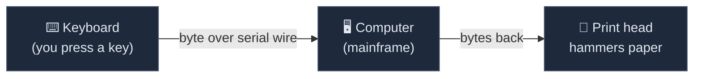
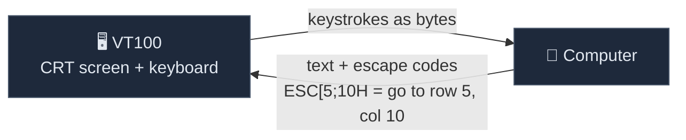
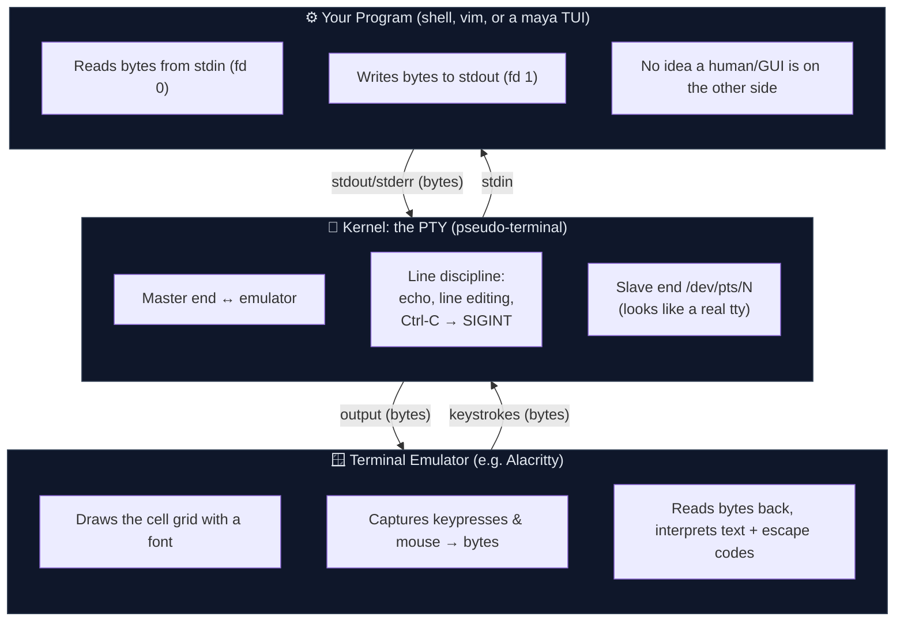
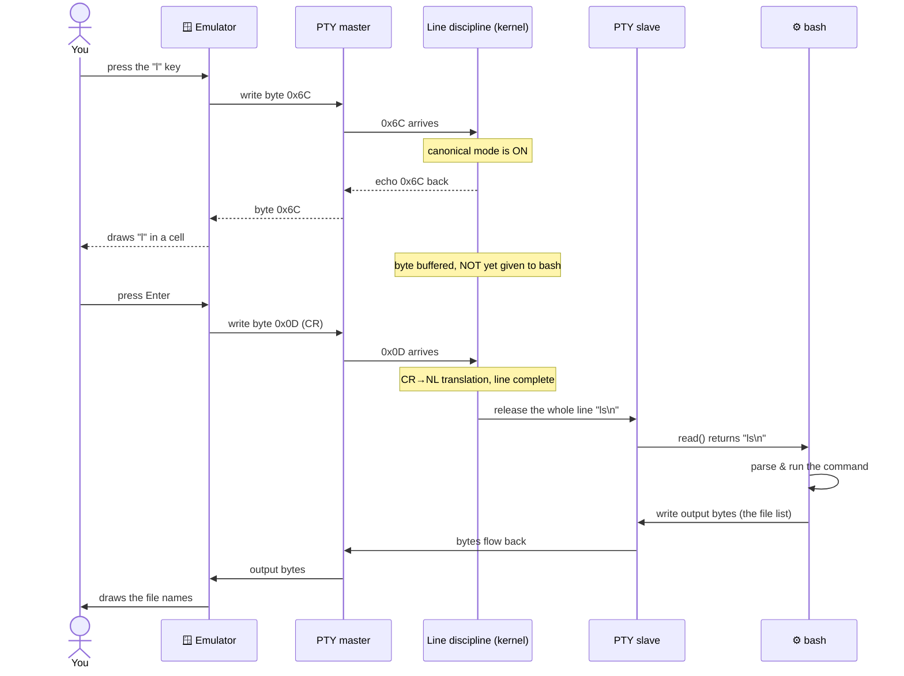
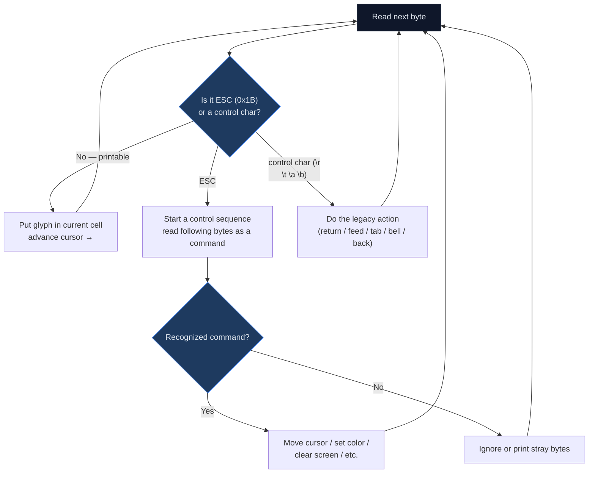
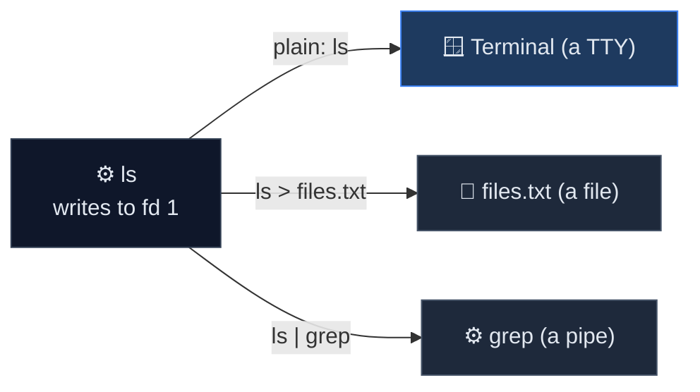

# What Is a Terminal?

You write code every day. You probably *open* a terminal every day. But have you
ever stopped to ask what a terminal actually **is**? Not "the black window where I
type `git status`" — but the real, layered machine underneath: what it draws, what
it understands, and why it behaves the way it does?

This is the first page of the **Foundations** series. By the end of it you'll have
a precise mental model of the terminal — the thing maya draws onto. Everything else
in this series (cells, escape codes, raw mode, rendering) builds on the ideas here.
We start from absolute zero. No prior TUI knowledge assumed.

!!! abstract "TL;DR"
    - A terminal is a **grid of character cells** (rows × columns), not a pixel canvas — and it talks in a **byte stream**, not a drawing API.
    - Today's "terminals" are **emulators**: GUI apps faithfully imitating 1970s hardware like the DEC VT100, which is why escape codes and ++ctrl+c++ behave the way they do.
    - The pieces people confuse — **emulator ≠ shell ≠ TTY/PTY** — are distinct layers. Your shell is just a program running *inside* the terminal.
    - Printable bytes become glyphs; bytes starting with ++esc++ are *commands* (move cursor, set color). Input keystrokes arrive as bytes too — even the arrow keys.

!!! note "Who this is for"
    A capable programmer who has never had to think hard about terminals. If you
    can write a `for` loop but you've never wondered what `\033[2J` does, you're in
    exactly the right place. 

---

## The one idea that changes everything

Here is the single most important thing to internalize, and almost everything else
follows from it:

!!! tip "The mental model"
    **A terminal is a grid of character cells. It is *not* a pixel canvas.**

When you draw in a web browser or a game, you think in **pixels**: "put a red dot at
(x=412, y=88)." You have millions of independently addressable points and you can
paint anything.

A terminal is nothing like that. A terminal is a **rectangular grid**, like a
spreadsheet or a sheet of graph paper. Each box in the grid is a **cell**, and each
cell holds **exactly one character** plus a little bit of styling (a foreground
color, a background color, maybe bold or underline). You don't address pixels — you
address **rows and columns**.

```text
        col 0   col 1   col 2   col 3   col 4   ...   col 79
       ┌───────┬───────┬───────┬───────┬───────┬─────┬───────┐
row 0  │   H   │   e   │   l   │   l   │   o   │ ... │       │
       ├───────┼───────┼───────┼───────┼───────┼─────┼───────┤
row 1  │   W   │   o   │   r   │   l   │   d   │ ... │       │
       ├───────┼───────┼───────┼───────┼───────┼─────┼───────┤
row 2  │       │       │       │       │       │ ... │       │
       └───────┴───────┴───────┴───────┴───────┴─────┴───────┘
                  (a classic 80×24 terminal: 80 columns, 24 rows)
```

The two coordinate systems are worth contrasting head-to-head, because almost every
"why doesn't my UI line up?" question traces back to this difference:

| | Pixel canvas (browser, game) | Cell grid (terminal) |
|---|---|---|
| **Atom** | a pixel (a colored point) | a cell (one character + style) |
| **Address** | `(x, y)` in pixels | `(row, column)` |
| **Resolution** | millions of points | a few thousand cells (e.g. 80×24 ≈ 1,920) |
| **What you place** | arbitrary color | one glyph, one fg/bg color, a few attributes |
| **Smallest move** | one pixel | one whole cell |

A "standard" terminal has historically been **80 columns wide and 24 rows tall**.
That number isn't arbitrary — and the reason why is a tiny piece of history worth
knowing.

!!! note "Why 80 columns?"
    The 80-column width is a fossil from **IBM punch cards**, which held 80
    characters per card. Early terminals matched that width, and the convention
    stuck so hard that "keep lines under 80 columns" is *still* a coding-style rule
    in many projects almost a century later.

Every cell is the **same size**. Characters are monospaced — an `i` and a `W`
occupy the same box. This is why ASCII art lines up in a terminal but turns to
garbage if you paste it into a word processor with a proportional font. The grid
*depends* on every glyph being one cell wide.

!!! warning "Some characters are *two* cells wide"
    The "one character per cell" rule has a famous exception: many East Asian
    characters (CJK) and a lot of emoji occupy **two** cells, not one. A 🐈 or a 漢
    is "double-width." This single fact is responsible for an astonishing amount of
    terminal pain — text that should line up suddenly doesn't, because the program
    counted *characters* when it should have counted *cells*. We'll return to this
    in **The Cell Grid**; for now, just file away that "one char = one cell" is
    *mostly* true, not *always* true.

---

## A little history (it explains the weirdness)

Terminals are weird. They have escape codes, "raw mode," control characters, and a
pile of conventions that seem to come from nowhere. They make a lot more sense once
you know they're emulating hardware from the 1960s and 70s. The abstractions you use
today exist because they had to talk to *physical machines*.

Here is the whole sweep of it — sixty-plus years from hammering paper to
GPU-accelerated glass:

| Era | When | Milestone | Why it still matters |
|-----|------|-----------|----------------------|
| **Act 1 · Paper** | 1869 | Typewriter mechanics | `\r` (carriage return) and `\n` (line feed) are *physical* motions we still send today |
| | 1963 | **ASCII** standardized | Fixed the byte values for letters **and control characters** (Tab, Esc, Bell…) |
| | 1963 | Teletype Model 33 (**ASR-33**) | The iconic paper terminal — "TTY" is named after it |
| | 1970s | Serial lines & **baud rates** | Terminals talked to mainframes over a slow wire — why "bytes-on-wire" is the eternal cost |
| **Act 2 · Glass** | 1975 | DEC **VT52** | Early video terminal; cursor addressing arrives |
| | 1978 | DEC **VT100** | **Escape sequences** become the de-facto standard we *still* use |
| | 1983 | DEC **VT220** | Function keys, national character sets |
| **Act 3 · Emulators** | 1984 | **xterm** | The X11 terminal emulator everyone else copied |
| | 2010s | tmux/screen, 256-color & truecolor | Multiplexing and rich color go mainstream |
| | Today | **GPU-accelerated** emulators | Alacritty, kitty, WezTerm, Ghostty — still speaking VT100's language |

### Act 1: Teletypes (the literal typewriters)

The earliest "terminals" were **teletypewriters** — electromechanical typewriters
hooked up to a computer over a wire. You typed a key, a byte went down the wire to
the computer; the computer sent bytes back, and a print head physically hammered
them onto a roll of **paper**.

The canonical example is the **Teletype Model 33 (ASR-33)**, introduced in 1963. It
ran at a stately **110 baud** — roughly **10 characters per second**. Read that
again: ten characters *per second*. A single screen of text today (a couple thousand
characters) would have taken several minutes to print. That glacial speed is the
hidden reason behind a surprising number of terminal habits.



This is where the abbreviation **TTY** comes from — *T*ele*TY*pewriter. You still
see it everywhere: `/dev/tty`, the `tty` command, "is this a tty?". A 60-year-old
piece of hardware is baked into the names of things you use today.

Because the output was *paper*, you couldn't "move the cursor up" to redraw a line —
the paper had already moved on. The only thing you could do was move forward and
emit special **control characters** to nudge the mechanism:

| Character | Byte | Name | What the teletype did |
|-----------|------|------|------------------------|
| `\r` | 13 | Carriage Return | Slam the print head back to the left margin |
| `\n` | 10 | Line Feed | Roll the paper up one line |
| `\t` | 9  | Horizontal Tab | Advance to the next tab stop |
| `\a` | 7  | Bell (BEL) | Ring an actual physical **bell** |
| `\b` | 8  | Backspace | Move the head left one position |
| `ESC` | 27 | Escape | "What follows is a command, not text" |

??? note "Why these legacies still bite you today"
    Almost every quirk in this table has a modern consequence:

    - **Slow speed → terse commands.** `ls`, `cp`, `rm`, `cd` are two-letter
      commands because at 10 chars/sec, *every byte you typed cost time*. Verbose
      command names would have been physically painful.
    - **Paper can't scroll back → append-only output.** Your shell's scrollback is
      an emulator feature bolted on later. The underlying model is still "text flows
      forward and is gone."
    - **The bell is still `\a`.** Modern terminals turn it into a beep or a visual
      flash, but the byte is the same one that rang a literal brass bell in 1963.

!!! note "Why is it `\r\n` on Windows?"
    On a real teletype, ending a line meant doing *two* physical things: return the
    carriage (`\r`) **and** feed the paper (`\n`). Windows still writes both bytes
    for a newline. Unix decided one byte (`\n`) was enough and let the driver handle
    the rest. That decades-old hardware detail is *literally* why your git diffs
    sometimes scream about line endings.

??? info "What is 'baud', and why should I care?"
    **Baud** is the signaling rate of a serial line — loosely, symbols per second.
    At 110 baud an ASR-33 moved ~10 characters a second; later terminals ran at 1200,
    9600, or 19200 baud. You still meet baud today whenever you talk to a microcontroller,
    a router console port, or a Raspberry Pi over a serial cable — and the
    `stty` command (which you'll use below) can still set it. The whole *byte-stream*
    nature of terminals comes directly from these one-wire serial origins: there was
    only ever one channel, carrying bytes, one after another.

### Act 2: Video terminals (the glass teletype)

In the 1970s, paper was replaced by a **CRT screen** — a "glass teletype." The most
famous was the **DEC VT100** (1978). Now something new was possible: because the
output was a screen, not paper, you could **move the cursor anywhere and overwrite
what was already there.**

But there was a problem. The wire could only carry bytes, and most bytes were needed
for ordinary text. How do you say "move the cursor to row 5, column 10" using a
stream that's mostly carrying letters?

The answer was **escape sequences**: a special byte — the **Escape** character
(`\033`, also written `\x1b` or ++esc++) — signals "the next few bytes aren't text,
they're a *command*." So `ESC [ 5 ; 10 H` means "move the cursor to row 5,
column 10." The VT100's command set became so dominant that it's effectively the
*standard* — which is why your `$TERM` is probably still `xterm-256color`, a direct
descendant.



The VT family evolved in steps, and each step left fingerprints on today's APIs:

| Terminal | Year | What it added | Legacy you still touch |
|----------|------|---------------|------------------------|
| **VT52** | 1975 | Direct cursor addressing | First "move the cursor" commands |
| **VT100** | 1978 | ANSI/ECMA-48 escape sequences, 80/132 columns | The dialect basically *everything* speaks today |
| **VT220** | 1983 | Function keys, multinational characters | The `F1`–`F12` and arrow-key escape codes |
| **xterm** | 1984 | The escape codes onto X11; later 256-color, mouse, titles | `xterm-256color`, the most common `$TERM` value |

!!! tip "This is the punchline of the whole history lesson"
    **Escape codes and raw mode aren't legacy cruft you have to tolerate — they're
    the actual API of the terminal.** Every colored prompt, every progress bar,
    every full-screen text editor works by writing VT100-lineage escape sequences to
    a byte stream. maya, vim, htop, and your shell's fancy prompt all speak the same
    1978 language.

### Act 3: Terminal emulators (today)

We don't have VT100 hardware on our desks anymore. Instead, we run a **terminal
emulator**: a normal graphical application that *pretends to be* a VT100 (and then
some). It opens a window, draws the cell grid using a font, and faithfully
interprets the same escape codes the real hardware did.

Modern emulators have even moved the drawing onto the **GPU**, rendering thousands
of cells per frame so that scrolling and animation are buttery smooth — something a
1978 CRT could never dream of, accomplished while still speaking the 1978 protocol.

=== "Linux / macOS"

    Common emulators you'll meet:

    - **GNOME Terminal**, **Konsole** (Linux desktops)
    - **iTerm2**, **Apple Terminal** (macOS)
    - **Alacritty**, **kitty**, **WezTerm**, **Ghostty** (GPU-accelerated, cross-platform)
    - The integrated terminals in **VS Code** and **Zed**

    The PTY machinery (next section) is native here — these all give your program a
    real `/dev/pts/N` slave device.

=== "Windows"

    Windows took a different road for decades. The classic `cmd.exe` console wasn't a
    VT100 emulator at all — programs called a special Console API instead of writing
    escape codes. That changed:

    - **Windows Terminal** is a modern, VT-speaking emulator.
    - **ConPTY** (added in Windows 10, 2018) finally gave Windows a real pseudo-terminal
      layer, so Unix-style TUI programs work much like they do elsewhere.
    - **WSL** runs a full Linux userland with genuine PTYs.

    The upshot: modern Windows finally speaks the same escape-code dialect, but the
    history is why "it works on my Mac but not in old `cmd.exe`" was a thing for years.

---

## The four words people mix up: terminal, emulator, shell, TTY/PTY

Beginners (and plenty of experts) blur these together. Let's separate them cleanly,
because every TUI bug eventually forces you to know which layer you're standing on.

| Term | What it is | Concrete example |
|------|-----------|------------------|
| **Terminal emulator** | The GUI app that draws the grid and handles your keyboard/mouse | iTerm2, Alacritty, Windows Terminal, GNOME Terminal, Zed's built-in terminal |
| **Shell** | A *program* that reads commands and runs them; it runs **inside** the terminal | `bash`, `zsh`, `fish`, `pwsh` |
| **TTY / PTY** | The kernel's pipe-with-special-powers that connects the two | `/dev/pts/3` on Linux |
| **Terminal** | Loosely, all of the above together — or strictly, the historical hardware | "open a terminal" |

The key insight that surprises beginners:

!!! tip "Your shell is just a program running inside the terminal"
    The terminal emulator does **not** know what `bash` is. It draws a grid and
    shunts bytes back and forth. `bash` is simply the program that happens to be
    running inside it. You can replace `bash` with `python`, or `vim`, or a maya app —
    the terminal doesn't care. It's a dumb, beautiful pipe-and-grid.

Here's how the layers actually stack up, and which direction the bytes flow:



### What's a PTY, exactly?

The original TTY was a wire to physical hardware. Today there's no hardware, so the
kernel provides a **PTY** — a **pseudo-terminal**. It's a software object with two
ends:

- The **master** end is held by the terminal emulator.
- The **slave** end (named `/dev/pts/3`, `/dev/pts/7`, etc. on Linux) is handed to
  your program as its stdin/stdout/stderr. To your program, it looks *exactly* like
  a real terminal would.

The PTY is more than a dumb pipe. It has a **line discipline** — a kernel layer that,
by default, does helpful things: it **echoes** your keystrokes back so you can see
what you type, it buffers a whole line so backspace works before you hit ++enter++, and
it turns ++ctrl+c++ into a `SIGINT` signal. TUI programs usually *turn most of this
off* by switching to **raw mode**, because they want every keystroke immediately and
unprocessed. (Raw mode gets its own page later in the series.)

!!! note "See it for yourself"
    Run `tty` in your shell. It prints the path of the slave PTY you're attached to,
    like `/dev/pts/2`. Open a second terminal and run `tty` there — you'll get a
    *different* number. Each window is its own pseudo-terminal.

### Worked example: what happens when I press a key in bash?

Let's trace a single keystroke all the way down and back. Say you've typed `l`, `s`
and now you press ++enter++ to run `ls`. Here's the journey of just the ++l++ key, then
the ++enter++:



The crucial, non-obvious detail: in the default **canonical (line) mode**, bash
*does not see your keystrokes one at a time*. The kernel's line discipline holds the
whole line, lets you backspace and edit it, **echoes** each character so you can see
it, and only hands the finished line to bash when you press ++enter++. That is why
backspace works at a shell prompt even though bash never "saw" the keys you erased.

!!! info "Raw mode flips this on its head"
    A TUI like vim or a maya app needs every keystroke the *instant* you press it —
    no waiting for ++enter++, no automatic echo, no ++ctrl+c++ stealing the key. So it
    switches the line discipline into **raw mode**: echo off, line buffering off,
    signals off. Now each byte goes straight to the program, which decides for itself
    what to draw. This single switch is what separates a "command line" from a
    "full-screen application."

---

## Everything is a byte stream

Strip away the history and the layers, and the terminal's contract is shockingly
simple:

!!! tip "The contract"
    Your program **writes bytes to stdout**. The terminal looks at each byte and
    decides: is this a **printable character** (put a glyph in a cell, advance the
    cursor) or part of a **control sequence** (do something special, like move the
    cursor or change the color)? Meanwhile, anything the user types arrives as
    **bytes on stdin**.

That's it. There is no "draw button" API, no "set pixel" call. There's a stream of
bytes going out and a stream of bytes coming in. A "user interface" is an *illusion*
you construct by writing exactly the right bytes in the right order.

### Output: text vs. control sequences

When the terminal reads bytes from your program, it sorts them into two buckets:

```text
   bytes your program writes:   H  e  l  l  o  ESC [ 3 1 m  W  o  r  l  d
                                └──── text ────┘└─ command ─┘└─ text ──┘
                                      │              │            │
                                      ▼              ▼            ▼
                            put glyphs in cells   "set fg     put glyphs,
                                                   to red"     now red
```

- **Printable bytes** (`H`, `e`, `l`, a space, a digit...) → drop a glyph into the
  current cell and move the cursor right by one.
- **An ESC byte** (`\033`) → "a command is coming." The terminal reads the following
  bytes as an instruction: move the cursor, change colors, clear the screen, hide
  the cursor, and so on.

This is the whole game. A full-screen app like vim or a maya dashboard is just an
extremely well-organized stream of "move here, set this color, print these glyphs,
move there, print those glyphs" — emitted dozens of times a second, fast enough that
your eye reads it as a stable, updating picture.

Here is the decision the terminal makes for *every single byte* it receives:



??? note "Anatomy of an escape sequence (you'll recognize these forever after)"
    Most of the sequences you'll see are **CSI** sequences — "Control Sequence
    Introducer" — which all begin with `ESC [`:

    ```text
    ESC  [    5 ; 10    H
     │   │      │       │
     │   │      │       └─ the final letter = the command (H = move cursor)
     │   │      └───────── parameters, separated by ;
     │   └──────────────── the "[" that marks a CSI sequence
     └──────────────────── the ESC byte that says "command coming"
    ```

    A few you'll meet constantly:

    | Sequence | Meaning |
    |----------|---------|
    | `ESC[2J` | Clear the entire screen |
    | `ESC[H` | Move cursor to top-left (row 1, col 1) |
    | `ESC[31m` | Set foreground color to red |
    | `ESC[0m` | Reset all styling back to normal |
    | `ESC[?25l` / `ESC[?25h` | Hide / show the cursor |

### Input: keystrokes are bytes too

Input is the mirror image. Press ++a++ and the byte `0x61` arrives on stdin. Press
++enter++ and you get `\r` (or `\n`). The interesting cases are the **special keys**:
arrows, function keys, ++page-up++. Those don't have a single byte — so the terminal
sends them *as escape sequences too*. Pressing the ++arrow-up++ arrow typically sends the
three bytes `ESC [ A`.

| Key | Bytes sent on stdin |
|-----|---------------------|
| ++a++ | `0x61` |
| ++enter++ | `\r` (0x0D) |
| ++tab++ | `\t` (0x09) |
| ++esc++ | `\033` (0x1B) — a *lone* ESC |
| ++arrow-up++ | `ESC [ A` |
| ++arrow-down++ | `ESC [ B` |
| ++arrow-right++ | `ESC [ C` |
| ++arrow-left++ | `ESC [ D` |
| ++ctrl+c++ | `0x03` (which the line discipline turns into SIGINT) |

!!! note "Yes — input and output use the same escape-code language"
    The ++arrow-up++ arrow sends `ESC[A`; moving the cursor up one row is `ESC[1A`. The
    overlap is not a coincidence. Both directions speak the VT100 dialect. This is
    also why pressing ++ctrl+v++ followed by another key in your shell will print
    the raw bytes that key produces — a great party trick and a great debugging tool.

!!! warning "The lonely ESC problem"
    Notice that ++esc++ *and* the start of every arrow-key sequence are both the byte
    `0x1B`. So when a program reads an ESC, it faces a genuine ambiguity: did the user
    press the Escape key, or is this the beginning of `ESC[A`? Programs resolve it by
    waiting a few milliseconds for more bytes. This is the famous reason some TUIs
    feel like they have a tiny lag after you press ++esc++ — they're waiting to be sure
    no arrow-key bytes are following.

---

## Capability detection: `$TERM`, `$COLORTERM`, `$TERM_PROGRAM`

Not all terminals can do all things. Some only do 16 colors; some do 256; modern
ones do 16 million ("true color"). Some support fancy underlines, hyperlinks, or
mouse reporting; some don't. Since your program writes blind into a byte stream, how
does it know what the terminal on the other end can handle?

Mostly by reading a few **environment variables** the terminal sets for you:

| Variable | What it tells you | Typical value |
|----------|-------------------|---------------|
| `$TERM` | The terminal *type* — historically an index into the `terminfo` capability database | `xterm-256color`, `screen`, `tmux-256color` |
| `$COLORTERM` | A hint about color depth, mainly used to detect 24-bit truecolor | `truecolor` or `24bit` |
| `$TERM_PROGRAM` | Which emulator app you're in (set by some, not all) | `iTerm.app`, `vscode`, `Apple_Terminal`, `WezTerm` |

```bash
echo "$TERM"          # e.g. xterm-256color
echo "$COLORTERM"     # e.g. truecolor   (may be empty)
echo "$TERM_PROGRAM"  # e.g. vscode      (may be empty)
```

`$TERM` is the old-school mechanism: it names a profile in **terminfo**, a database
that maps capabilities ("how do I clear the screen on *this* terminal?") to the exact
escape sequences. The `tput` command is the friendly front-end to that database (try
the snippets below).

??? info "terminfo vs. termcap, and why two databases exist"
    Originally there was **termcap** ("terminal capabilities"), a single text file
    describing every known terminal. It was slow to parse, so it was superseded by
    **terminfo**, a compiled, indexed database (one file per terminal, usually under
    `/usr/share/terminfo/`). When a program asks "how do I make this terminal go
    bold?", it looks up `$TERM` in terminfo and gets back the exact bytes. You can
    inspect the entry for your own terminal with `infocmp` (see "Try it yourself").
    Both names survive in tooling, which is why you'll occasionally see "termcap" in
    documentation written decades apart.

### Asking the terminal directly: the query/response handshake

Environment variables are *static guesses*. There's a more reliable trick: the
program can **send the terminal a question** as an escape sequence, and the terminal
**writes an answer back on stdin**. The terminal literally talks back.

```mermaid
sequenceDiagram
    participant Prog as ⚙️ Your program
    participant Term as 🪟 Terminal
    Prog->>Term: write "ESC[c"  (DA1: "who are you?")
    Term-->>Prog: reply on stdin "ESC[?64;1;...c" (capabilities)
    Prog->>Term: write "ESC[6n" (DSR: "where's the cursor?")
    Term-->>Prog: reply on stdin "ESC[12;40R" (row 12, col 40)
```

- **DA1** (`ESC[c`, *Device Attributes*) asks "what kind of terminal are you, and
  what can you do?" The terminal answers with a list of capability codes.
- **DSR** (`ESC[6n`, *Device Status Report*) asks "where is the cursor right now?"
  The terminal answers `ESC[<row>;<col>R`. Frameworks use a clever version of this to
  *discover the screen size* or detect double-width rendering by printing something
  and asking where the cursor ended up.

!!! warning "Don't over-trust the environment variables"
    `$TERM` is frequently set to a conservative value, `$COLORTERM` is often missing
    even on capable terminals, and `$TERM_PROGRAM` isn't set by many emulators at
    all. Robust TUI frameworks combine these hints with the *runtime query handshake*
    above. The takeaway for now: capability detection is *a real problem*, and it's
    one of the many things a framework like maya handles so you don't have to.

---

## stdin, stdout, stderr, and "isatty"

Every program starts life with three byte streams already open:

| Stream | Number (fd) | Default destination | Purpose |
|--------|-------------|---------------------|---------|
| **stdin**  | 0 | your keyboard (via the PTY) | bytes coming *in* |
| **stdout** | 1 | your terminal screen | normal output |
| **stderr** | 2 | your terminal screen | errors & diagnostics |

The crucial twist: **these streams don't have to point at a terminal at all.** The
shell can redirect them. That's the whole basis of Unix pipes:

```bash
ls                 # stdout → your terminal (you see a grid of names)
ls > files.txt     # stdout → a file        (nothing on screen)
ls | grep ".md"    # stdout → another program's stdin
```

Visually, redirection just re-points where fd 1 sends its bytes:



When stdout goes to a file or a pipe, **there is no cell grid on the other end** —
just a sink that swallows bytes. So a program needs to ask: "Am I actually attached
to a terminal right now, or to a file/pipe?" The answer comes from a system call
named **`isatty`** ("is a TTY?"). Under the hood, `isatty(fd)` asks the kernel
whether the file descriptor refers to a terminal device (a TTY/PTY) — it returns
true for `/dev/pts/3`, and false for a regular file or a pipe.

!!! tip "Why `ls` changes its mind when you pipe it"
    Run `ls` in a terminal and you get neat columns, often with color. Run
    `ls | cat` and suddenly it's one filename per line, no color. `ls` calls
    `isatty(stdout)`: if it's a real terminal, it formats for humans (columns,
    color); if it's a pipe, it formats for machines (one item per line, no escape
    codes that would corrupt the data downstream). Many well-behaved tools do this —
    `grep`, `git`, and `ls` all switch off color when their output isn't a terminal.

This is also why you should write **diagnostics to stderr, not stdout**: if someone
does `myprogram > output.txt`, your error messages still reach the screen instead of
silently polluting `output.txt`. The two streams are separate fds precisely so they
can be redirected independently.

!!! warning "A TUI needs a real terminal"
    A full-screen TUI fundamentally *requires* a real terminal — it needs to know
    the grid dimensions, move the cursor, and read raw keystrokes. Piping a TUI's
    output to a file produces a mess of literal escape codes. Frameworks like maya
    check `isatty` and refuse (or degrade gracefully) when there's no terminal on the
    other end, which is exactly the right thing to do.

---

## Try it yourself

Reading about byte streams is fine; *feeling* them is better. Open a terminal and
run these. Each one writes raw bytes and lets you watch the grid react. None of them
will harm anything.

!!! example "1. Plain text vs. an escape code"
    `printf` (unlike some `echo`s) interprets backslash escapes, so we can send a
    raw ++esc++ byte (`\033`):

    ```bash
    # 31 = red foreground, 0 = reset back to normal
    printf '\033[31mThis is red\033[0m and this is normal\n'
    ```

    **Expected:** the words "This is red" appear in red, the rest in your normal
    color. **Why:** `\033[31m` set the foreground to red; everything after it was
    painted red until `\033[0m` reset the styling.

!!! example "2. Move the cursor around the grid"
    This jumps to row 5, column 20 and prints there, proving you address cells by
    (row, column):

    ```bash
    printf '\033[5;20HI am at row 5, column 20\n'
    ```

    **Expected:** the text appears partway down and indented, *not* on the current
    line. **Why:** `\033[5;20H` is the CSI "cursor position" command (`H`) with
    parameters `5;20`.

!!! example "3. Ring the 1960s bell"
    The byte `\a` is a direct descendant of the teletype bell:

    ```bash
    printf '\a'   # your terminal beeps or flashes
    ```

    **Expected:** an audible beep or a visual flash (depends on your settings).
    **Why:** byte 7 (BEL) once rang a literal bell; emulators reinterpret it.

!!! example "4. Ask `tput` instead of memorizing codes"
    `tput` looks up the right sequence for *your* terminal in terminfo:

    ```bash
    tput cols       # how many columns wide is your grid right now?
    tput lines      # how many rows tall?
    tput bold; echo "bold text"; tput sgr0        # sgr0 = reset all attributes
    tput setaf 2; echo "green text"; tput sgr0    # setaf 2 = foreground green
    ```

    **Expected:** two numbers (e.g. `120` and `30`), then bold text, then green
    text. **Why:** `tput` translates capability *names* into the exact escape bytes
    your `$TERM` needs — portable across terminals.

    !!! tip "Resize your window and run `tput cols` again"
        The number changes. The grid isn't fixed — it's whatever your emulator window
        currently is. (When the size changes, the kernel sends your program a
        `SIGWINCH` signal so it can re-layout. That's how `htop` and maya apps reflow
        instantly when you drag the window edge.)

!!! example "5. See the line discipline with `stty`"
    This prints your terminal's current input settings — echo, line editing, the
    works:

    ```bash
    stty -a
    ```

    **Expected:** a block of flags like `speed 38400 baud`, `echo`, `icanon`.
    **Why:** these flags *are* the line discipline. `echo` means keystrokes are
    mirrored back; `icanon` (canonical mode) means input is line-buffered. When a TUI
    enters raw mode, it flips exactly these off.

    !!! warning "If you ever wreck your terminal"
        Don't change these by hand for fun. If you ever leave a terminal in a weird
        state (garbled text, no echo), the magic incantation `stty sane` — or just
        typing `reset` and pressing ++enter++ — puts it right.

!!! example "6. Peek at the layers"
    ```bash
    tty            # which pseudo-terminal am I on? e.g. /dev/pts/2
    echo "$TERM"   # what terminal type am I claiming to be?
    ps             # see the shell process running *inside* this terminal
    ```

    **Expected:** a `/dev/pts/N` path, a `$TERM` string, and a short process list
    including your shell. **Why:** these three peel back the three layers —
    PTY, capability profile, and the program running inside.

!!! example "7. Read your terminal's own terminfo entry"
    ```bash
    infocmp        # dump the full capability list for $TERM
    ```

    **Expected:** a long list of capabilities and their escape sequences, like
    `clear=\E[H\E[2J` (notice `\E` is just ESC) and `cup=\E[%i%p1%d;%p2%dH` (the
    cursor-position template). **Why:** this *is* terminfo — every fancy thing your
    terminal can do, mapped to bytes.

!!! example "8. Watch the bytes a key produces"
    Run `cat -v` (it shows control characters visibly), then press some keys and
    watch:

    ```bash
    cat -v
    ```

    Press the ++arrow-up++ arrow and you'll see `^[[A` (where `^[` is ESC). Press
    ++esc++ alone and you'll see `^[`. Press ++ctrl+c++ to exit. **Why:** you're
    seeing input arrive as raw bytes — exactly the escape sequences from the table
    above.

---

## Common misconceptions

A handful of beliefs trip up nearly everyone learning this. Expand each to see why
it's wrong.

??? note "“The terminal knows what bash is.”"
    No. The emulator is a dumb grid-and-pipe. It draws cells and shuttles bytes. The
    program on the other end could be `bash`, `python`, `vim`, or a maya app — the
    terminal can't tell and doesn't care. "Open a terminal" really means "open an
    emulator that launches your *default shell* inside it," but the shell is just the
    default passenger, not part of the terminal itself.

??? note "“Colors and bold are special features of my text.”"
    They're not attached to your text at all — they're *escape codes interleaved into
    the byte stream*. `\033[31m` doesn't color anything by itself; it flips a "current
    color" switch in the terminal, and every glyph printed *after* it inherits that
    color until you reset it with `\033[0m`. Forget the reset and the color "leaks"
    into your prompt — a classic bug.

??? note "“The Escape key and the arrow keys are unrelated.”"
    They share the same first byte (`0x1B`). An arrow key is `ESC` followed by more
    bytes; a bare ++esc++ is just `0x1B` with nothing after. That overlap is the source
    of the tiny delay some apps have after ++esc++ — they wait to see if more bytes
    (an arrow sequence) are coming.

??? note "“`echo` and `printf` are the same thing.”"
    Close, but `printf '\033[31m...'` reliably interprets the `\033` escape, whereas
    plain `echo` may print the backslashes literally (it varies by shell and flags).
    When you need to emit real control bytes, reach for `printf`, or `echo -e` where
    supported.

??? note "“A pixel and a cell are roughly the same idea.”"
    A cell is enormously coarser. An 80×24 grid is under 2,000 cells; a modest screen
    has *millions* of pixels. You can't put a glyph at an arbitrary pixel — only in a
    cell. Trying to think in pixels is the single biggest mental-model error a TUI
    beginner makes.

??? note "“Piping output should look the same as the terminal.”"
    Often it deliberately doesn't. Many tools call `isatty` and switch off columns and
    color when their output is a pipe or file, so the downstream consumer gets clean,
    machine-readable data. `ls` vs. `ls | cat` is the canonical demonstration.

---

## So why is this hard? (Why maya exists)

You now know the terminal's real contract: **bytes out, bytes in, a grid of cells,
and a 1970s escape-code dialect.** It looks simple. Drawing a real UI on it is
not. Here's a partial checklist of what you'd have to handle by hand:

- [ ] **Diffing the grid** — repainting the whole screen every frame is slow and
  flickers; you want to send bytes *only* for the cells that changed.
- [ ] **Layout** — "center this box, sidebar on the left, wrap that text"; there's no
  layout engine, so you compute every row and column yourself.
- [ ] **Double-width characters & Unicode** — get the 🐈 width wrong and your whole UI
  shears sideways.
- [ ] **Capability detection** — 16 vs 256 vs truecolor, degrading gracefully when a
  terminal can't keep up.
- [ ] **Raw mode & input parsing** — turning `ESC[A` back into "the user pressed
  ++arrow-up++" without mistaking a real ++esc++ for the start of a sequence.
- [ ] **Resize, cursor hiding, alternate screen, cleanup on crash** — and a dozen more
  papercuts.

!!! note "This is the gap maya fills"
    **maya** is a C++ TUI framework that sits on top of everything you just learned.
    You describe *what* the UI should look like — boxes, text, colors, layout — and
    maya figures out the exact bytes to write, when to write them, and how to do it
    fast. You think in cells and components; maya speaks fluent VT100 underneath. The
    rest of this Foundations series teaches you that underlying machinery so that when
    you use maya (or debug a TUI at 2am), you understand exactly what's happening.

    Here's the same checklist, but as maya's job rather than yours:

    - [x] Diff the grid and write minimal bytes
    - [x] Lay out boxes, rows, and columns
    - [x] Measure character widths correctly
    - [x] Detect capabilities and degrade gracefully
    - [x] Manage raw mode and parse input
    - [x] Handle resize, cursor, alternate screen, and cleanup

---

## What's next

You've got the big picture: a terminal is a **byte-stream-driven grid of cells**,
emulating decades-old hardware, with a shell or your program running inside it.

The next page zooms all the way into that grid. What *exactly* lives in a single
cell? How do characters, colors, and attributes pack together? Why is the cell — not
the pixel — the atom of everything maya draws?

[**Next: The Cell Grid →**](the-cell-grid.md){ .md-button .md-button--primary }

!!! tip "Foundations recap so far"
    - A terminal is a **grid of character cells** (rows × columns), not a pixel
      canvas.
    - Today's terminals are **emulators** faithfully imitating hardware like the
      VT100 — now often GPU-accelerated.
    - **Emulator ≠ shell ≠ TTY/PTY** — they're distinct layers; your shell is just a
      program running inside the terminal.
    - Communication is a **byte stream**: printable bytes become glyphs; ++esc++
      sequences are commands. Input arrives as bytes too — even the arrow keys.
    - `$TERM` / `$COLORTERM` / `$TERM_PROGRAM`, the DA1/DSR query handshake, and
      `isatty` let a program discover *where* it's running and *what* it can do.
